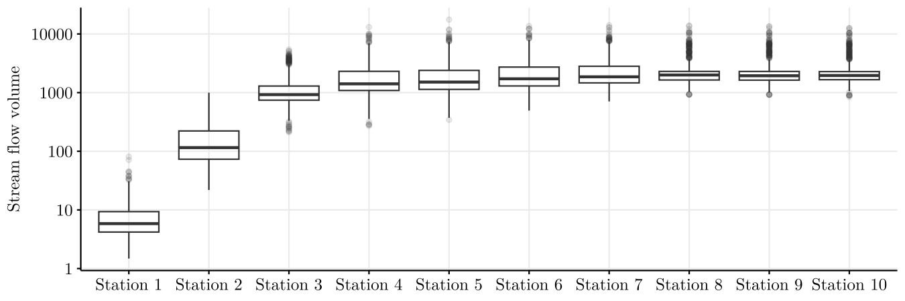

## Agenda

## Vector-Valued Stochastic Processes {.smaller}

- $\bf X^{(i)} = \big(X_1^{(i)}, X_2^{(i)}, \dots, X_d^{(i)}\big).$

- $X_v^{(i)} \in A,$ $A$ a finite alphabet.

- Process $\bf X = \{X^{(i)}: -\infty<i<\infty\}.$

- We assume the process $\bf X$ has an underlying graph $G^* = (V, E^*).$

```{r, engine = 'tikz', fig.align='center', out.height='400px', out.width='667px'}
% Created by tikzDevice version 0.12.4 on 2024-03-25 21:10:44
% !TEX encoding = UTF-8 Unicode
\begin{tikzpicture}[x=1pt,y=1pt]
\definecolor{fillColor}{RGB}{255,255,255}
\path[use as bounding box,fill=fillColor,fill opacity=0.00] (0,0) rectangle (361.35,216.81);
\begin{scope}
\path[clip] (  0.00,  0.00) rectangle (361.35,216.81);
\definecolor{drawColor}{RGB}{255,255,255}
\definecolor{fillColor}{RGB}{255,255,255}

\path[draw=drawColor,line width= 0.6pt,line join=round,line cap=round,fill=fillColor] (  0.00,  0.00) rectangle (361.35,216.81);
\end{scope}
\begin{scope}
\path[clip] ( 40.82, 37.04) rectangle (355.85,211.31);
\definecolor{fillColor}{RGB}{255,255,255}

\path[fill=fillColor] ( 40.82, 37.04) rectangle (355.85,211.31);
\definecolor{drawColor}{RGB}{0,0,0}

\node[text=drawColor,anchor=base,inner sep=0pt, outer sep=0pt, scale=  1.10] at ( 81.18, 60.97) {$x_1^{(1)}$};

\node[text=drawColor,anchor=base,inner sep=0pt, outer sep=0pt, scale=  1.10] at ( 81.18,100.57) {$x_2^{(1)}$};

\node[text=drawColor,anchor=base,inner sep=0pt, outer sep=0pt, scale=  1.10] at ( 81.18,179.78) {$x_d^{(1)}$};

\node[text=drawColor,anchor=base,inner sep=0pt, outer sep=0pt, scale=  1.10] at (133.25, 60.97) {$x_1^{(2)}$};

\node[text=drawColor,anchor=base,inner sep=0pt, outer sep=0pt, scale=  1.10] at (133.25,100.57) {$x_2^{(2)}$};

\node[text=drawColor,anchor=base,inner sep=0pt, outer sep=0pt, scale=  1.10] at (133.25,179.78) {$x_d^{(2)}$};

\node[text=drawColor,anchor=base,inner sep=0pt, outer sep=0pt, scale=  1.10] at (185.32, 60.97) {$x_1^{(3)}$};

\node[text=drawColor,anchor=base,inner sep=0pt, outer sep=0pt, scale=  1.10] at (185.32,100.57) {$x_2^{(3)}$};

\node[text=drawColor,anchor=base,inner sep=0pt, outer sep=0pt, scale=  1.10] at (185.32,179.78) {$x_d^{(3)}$};

\node[text=drawColor,anchor=base,inner sep=0pt, outer sep=0pt, scale=  1.10] at (289.46, 60.97) {$x_1^{(n)}$};

\node[text=drawColor,anchor=base,inner sep=0pt, outer sep=0pt, scale=  1.10] at (289.46,100.57) {$x_2^{(n)}$};

\node[text=drawColor,anchor=base,inner sep=0pt, outer sep=0pt, scale=  1.10] at (289.46,179.78) {$x_d^{(n)}$};

\node[text=drawColor,anchor=base,inner sep=0pt, outer sep=0pt, scale=  1.10] at (237.39, 60.97) {$\dots$};

\node[text=drawColor,anchor=base,inner sep=0pt, outer sep=0pt, scale=  1.10] at (237.39,100.57) {$\dots$};

\node[text=drawColor,anchor=base,inner sep=0pt, outer sep=0pt, scale=  1.10] at (237.39,140.18) {$\dots$};

\node[text=drawColor,anchor=base,inner sep=0pt, outer sep=0pt, scale=  1.10] at (237.39,179.78) {$\dots$};

\node[text=drawColor,anchor=base,inner sep=0pt, outer sep=0pt, scale=  1.10] at ( 81.18,140.18) {$\vdots$};

\node[text=drawColor,anchor=base,inner sep=0pt, outer sep=0pt, scale=  1.10] at (133.25,140.18) {$\vdots$};

\node[text=drawColor,anchor=base,inner sep=0pt, outer sep=0pt, scale=  1.10] at (185.32,140.18) {$\vdots$};

\node[text=drawColor,anchor=base,inner sep=0pt, outer sep=0pt, scale=  1.10] at (289.46,140.18) {$\vdots$};
\end{scope}
\begin{scope}
\path[clip] (  0.00,  0.00) rectangle (361.35,216.81);
\definecolor{drawColor}{RGB}{0,0,0}

\path[draw=drawColor,line width= 0.6pt,line join=round] ( 40.82, 37.04) --
	( 40.82,211.31);
\end{scope}
\begin{scope}
\path[clip] (  0.00,  0.00) rectangle (361.35,216.81);
\definecolor{drawColor}{gray}{0.30}

\node[text=drawColor,anchor=base east,inner sep=0pt, outer sep=0pt, scale=  1.20] at ( 35.87, 60.64) {$X_1$};

\node[text=drawColor,anchor=base east,inner sep=0pt, outer sep=0pt, scale=  1.20] at ( 35.87,100.24) {$X_2$};

\node[text=drawColor,anchor=base east,inner sep=0pt, outer sep=0pt, scale=  1.20] at ( 35.87,179.45) {$X_d$};
\end{scope}
\begin{scope}
\path[clip] (  0.00,  0.00) rectangle (361.35,216.81);
\definecolor{drawColor}{gray}{0.20}

\path[draw=drawColor,line width= 0.6pt,line join=round] ( 38.07, 64.77) --
	( 40.82, 64.77);

\path[draw=drawColor,line width= 0.6pt,line join=round] ( 38.07,104.37) --
	( 40.82,104.37);

\path[draw=drawColor,line width= 0.6pt,line join=round] ( 38.07,183.59) --
	( 40.82,183.59);
\end{scope}
\begin{scope}
\path[clip] (  0.00,  0.00) rectangle (361.35,216.81);
\definecolor{drawColor}{RGB}{0,0,0}

\path[draw=drawColor,line width= 0.6pt,line join=round] ( 40.82, 37.04) --
	(355.85, 37.04);
\definecolor{fillColor}{RGB}{0,0,0}

\path[draw=drawColor,line width= 0.6pt,line join=round,fill=fillColor] (347.19, 32.04) --
	(355.85, 37.04) --
	(347.19, 42.04) --
	cycle;
\end{scope}
\begin{scope}
\path[clip] (  0.00,  0.00) rectangle (361.35,216.81);
\definecolor{drawColor}{gray}{0.20}

\path[draw=drawColor,line width= 0.6pt,line join=round] ( 81.18, 34.29) --
	( 81.18, 37.04);

\path[draw=drawColor,line width= 0.6pt,line join=round] (133.25, 34.29) --
	(133.25, 37.04);

\path[draw=drawColor,line width= 0.6pt,line join=round] (185.32, 34.29) --
	(185.32, 37.04);

\path[draw=drawColor,line width= 0.6pt,line join=round] (289.46, 34.29) --
	(289.46, 37.04);
\end{scope}
\begin{scope}
\path[clip] (  0.00,  0.00) rectangle (361.35,216.81);
\definecolor{drawColor}{gray}{0.30}

\node[text=drawColor,anchor=base,inner sep=0pt, outer sep=0pt, scale=  1.20] at ( 81.18, 23.83) {1};

\node[text=drawColor,anchor=base,inner sep=0pt, outer sep=0pt, scale=  1.20] at (133.25, 23.83) {2};

\node[text=drawColor,anchor=base,inner sep=0pt, outer sep=0pt, scale=  1.20] at (185.32, 23.83) {3};

\node[text=drawColor,anchor=base,inner sep=0pt, outer sep=0pt, scale=  1.20] at (289.46, 23.83) {$n$};
\end{scope}
\begin{scope}
\path[clip] (  0.00,  0.00) rectangle (361.35,216.81);
\definecolor{drawColor}{RGB}{0,0,0}

\node[text=drawColor,anchor=base east,inner sep=0pt, outer sep=0pt, scale=  1.50] at (355.85,  8.42) {$t$};
\end{scope}
\begin{scope}
\path[clip] (  0.00,  0.00) rectangle (361.35,216.81);
\definecolor{drawColor}{RGB}{0,0,0}

\node[text=drawColor,anchor=base east,inner sep=0pt, outer sep=0pt, scale=  1.50] at ( 17.58,200.98) {$V$};
\end{scope}
\end{tikzpicture}

```

::: {.callout-important}
Diferente de modelos em *lattice* (grades regulares), o grafo $G^*$ aqui é geral e não-homogêneo.
:::

## Vector-Valued Stochastic Processes {.smaller}

- $\bf X^{(i)} = \big(X_1^{(i)}, X_2^{(i)}, \dots, X_d^{(i)}\big).$

- $X_v^{(i)} \in A,$ $A$ a finite alphabet.

- Process $\bf X = \{X^{(i)}: -\infty<i<\infty\}.$

- We assume the process $\bf X$ has an underlying graph $G^* = (V, E^*).$

```{r, engine = 'tikz', fig.align='center', out.height='400px', out.width='667px'}
% Created by tikzDevice version 0.12.4 on 2024-03-25 21:11:34
% !TEX encoding = UTF-8 Unicode
\begin{tikzpicture}[x=1pt,y=1pt]
\definecolor{fillColor}{RGB}{255,255,255}
\path[use as bounding box,fill=fillColor,fill opacity=0.00] (0,0) rectangle (361.35,216.81);
\begin{scope}
\path[clip] (  0.00,  0.00) rectangle (361.35,216.81);
\definecolor{drawColor}{RGB}{255,255,255}
\definecolor{fillColor}{RGB}{255,255,255}

\path[draw=drawColor,line width= 0.6pt,line join=round,line cap=round,fill=fillColor] (  0.00,  0.00) rectangle (361.35,216.81);
\end{scope}
\begin{scope}
\path[clip] ( 40.82, 37.04) rectangle (355.85,211.31);
\definecolor{fillColor}{RGB}{255,255,255}

\path[fill=fillColor] ( 40.82, 37.04) rectangle (355.85,211.31);
\definecolor{drawColor}{RGB}{0,0,0}

\node[text=drawColor,anchor=base,inner sep=0pt, outer sep=0pt, scale=  1.10] at ( 81.18, 60.97) {$x_1^{(1)}$};

\node[text=drawColor,anchor=base,inner sep=0pt, outer sep=0pt, scale=  1.10] at ( 81.18,100.57) {$x_2^{(1)}$};

\node[text=drawColor,anchor=base,inner sep=0pt, outer sep=0pt, scale=  1.10] at ( 81.18,179.78) {$x_d^{(1)}$};

\node[text=drawColor,anchor=base,inner sep=0pt, outer sep=0pt, scale=  1.10] at (133.25, 60.97) {$x_1^{(2)}$};

\node[text=drawColor,anchor=base,inner sep=0pt, outer sep=0pt, scale=  1.10] at (133.25,100.57) {$x_2^{(2)}$};

\node[text=drawColor,anchor=base,inner sep=0pt, outer sep=0pt, scale=  1.10] at (133.25,179.78) {$x_d^{(2)}$};

\node[text=drawColor,anchor=base,inner sep=0pt, outer sep=0pt, scale=  1.10] at (185.32, 60.97) {$x_1^{(3)}$};

\node[text=drawColor,anchor=base,inner sep=0pt, outer sep=0pt, scale=  1.10] at (185.32,100.57) {$x_2^{(3)}$};

\node[text=drawColor,anchor=base,inner sep=0pt, outer sep=0pt, scale=  1.10] at (185.32,179.78) {$x_d^{(3)}$};

\node[text=drawColor,anchor=base,inner sep=0pt, outer sep=0pt, scale=  1.10] at (289.46, 60.97) {$x_1^{(n)}$};

\node[text=drawColor,anchor=base,inner sep=0pt, outer sep=0pt, scale=  1.10] at (289.46,100.57) {$x_2^{(n)}$};

\node[text=drawColor,anchor=base,inner sep=0pt, outer sep=0pt, scale=  1.10] at (289.46,179.78) {$x_d^{(n)}$};

\node[text=drawColor,anchor=base,inner sep=0pt, outer sep=0pt, scale=  1.10] at (237.39, 60.97) {$\dots$};

\node[text=drawColor,anchor=base,inner sep=0pt, outer sep=0pt, scale=  1.10] at (237.39,100.57) {$\dots$};

\node[text=drawColor,anchor=base,inner sep=0pt, outer sep=0pt, scale=  1.10] at (237.39,140.18) {$\dots$};

\node[text=drawColor,anchor=base,inner sep=0pt, outer sep=0pt, scale=  1.10] at (237.39,179.78) {$\dots$};

\node[text=drawColor,anchor=base,inner sep=0pt, outer sep=0pt, scale=  1.10] at ( 81.18,140.18) {$\vdots$};

\node[text=drawColor,anchor=base,inner sep=0pt, outer sep=0pt, scale=  1.10] at (133.25,140.18) {$\vdots$};

\node[text=drawColor,anchor=base,inner sep=0pt, outer sep=0pt, scale=  1.10] at (185.32,140.18) {$\vdots$};

\node[text=drawColor,anchor=base,inner sep=0pt, outer sep=0pt, scale=  1.10] at (289.46,140.18) {$\vdots$};
\definecolor{drawColor}{RGB}{217,95,2}
\definecolor{fillColor}{RGB}{217,95,2}

\path[draw=drawColor,line width= 0.6pt,fill=fillColor,fill opacity=0.10] (107.21, 54.87) rectangle (211.35,116.26);
\end{scope}
\begin{scope}
\path[clip] (  0.00,  0.00) rectangle (361.35,216.81);
\definecolor{drawColor}{RGB}{0,0,0}

\path[draw=drawColor,line width= 0.6pt,line join=round] ( 40.82, 37.04) --
	( 40.82,211.31);
\end{scope}
\begin{scope}
\path[clip] (  0.00,  0.00) rectangle (361.35,216.81);
\definecolor{drawColor}{gray}{0.30}

\node[text=drawColor,anchor=base east,inner sep=0pt, outer sep=0pt, scale=  1.20] at ( 35.87, 60.64) {$X_1$};

\node[text=drawColor,anchor=base east,inner sep=0pt, outer sep=0pt, scale=  1.20] at ( 35.87,100.24) {$X_2$};

\node[text=drawColor,anchor=base east,inner sep=0pt, outer sep=0pt, scale=  1.20] at ( 35.87,179.45) {$X_d$};
\end{scope}
\begin{scope}
\path[clip] (  0.00,  0.00) rectangle (361.35,216.81);
\definecolor{drawColor}{gray}{0.20}

\path[draw=drawColor,line width= 0.6pt,line join=round] ( 38.07, 64.77) --
	( 40.82, 64.77);

\path[draw=drawColor,line width= 0.6pt,line join=round] ( 38.07,104.37) --
	( 40.82,104.37);

\path[draw=drawColor,line width= 0.6pt,line join=round] ( 38.07,183.59) --
	( 40.82,183.59);
\end{scope}
\begin{scope}
\path[clip] (  0.00,  0.00) rectangle (361.35,216.81);
\definecolor{drawColor}{RGB}{0,0,0}

\path[draw=drawColor,line width= 0.6pt,line join=round] ( 40.82, 37.04) --
	(355.85, 37.04);
\definecolor{fillColor}{RGB}{0,0,0}

\path[draw=drawColor,line width= 0.6pt,line join=round,fill=fillColor] (347.19, 32.04) --
	(355.85, 37.04) --
	(347.19, 42.04) --
	cycle;
\end{scope}
\begin{scope}
\path[clip] (  0.00,  0.00) rectangle (361.35,216.81);
\definecolor{drawColor}{gray}{0.20}

\path[draw=drawColor,line width= 0.6pt,line join=round] ( 81.18, 34.29) --
	( 81.18, 37.04);

\path[draw=drawColor,line width= 0.6pt,line join=round] (133.25, 34.29) --
	(133.25, 37.04);

\path[draw=drawColor,line width= 0.6pt,line join=round] (185.32, 34.29) --
	(185.32, 37.04);

\path[draw=drawColor,line width= 0.6pt,line join=round] (289.46, 34.29) --
	(289.46, 37.04);
\end{scope}
\begin{scope}
\path[clip] (  0.00,  0.00) rectangle (361.35,216.81);
\definecolor{drawColor}{gray}{0.30}

\node[text=drawColor,anchor=base,inner sep=0pt, outer sep=0pt, scale=  1.20] at ( 81.18, 23.83) {1};

\node[text=drawColor,anchor=base,inner sep=0pt, outer sep=0pt, scale=  1.20] at (133.25, 23.83) {2};

\node[text=drawColor,anchor=base,inner sep=0pt, outer sep=0pt, scale=  1.20] at (185.32, 23.83) {3};

\node[text=drawColor,anchor=base,inner sep=0pt, outer sep=0pt, scale=  1.20] at (289.46, 23.83) {$n$};
\end{scope}
\begin{scope}
\path[clip] (  0.00,  0.00) rectangle (361.35,216.81);
\definecolor{drawColor}{RGB}{0,0,0}

\node[text=drawColor,anchor=base east,inner sep=0pt, outer sep=0pt, scale=  1.50] at (355.85,  8.42) {$t$};
\end{scope}
\begin{scope}
\path[clip] (  0.00,  0.00) rectangle (361.35,216.81);
\definecolor{drawColor}{RGB}{0,0,0}

\node[text=drawColor,anchor=base east,inner sep=0pt, outer sep=0pt, scale=  1.50] at ( 17.58,200.98) {$V$};
\end{scope}
\end{tikzpicture}

```

::: {.callout-important}
Diferente de modelos em *lattice* (grades regulares), o grafo $G^*$ aqui é geral e não-homogêneo.
:::

## Por que ir além do IID? {.smaller}

A maioria das técnicas tradicionais assume que as observações $\mathbf{X}^{(1)}, \mathbf{X}^{(2)}, \dots$ são independentes (iid). 

No entanto, em cenários reais, a independência é restritiva:

- **Séries Temporais de EEG**: Dependência neural ao longo do tempo.
- **Fluxo de Rios**: Dependência hidrológica sequencial.
- **Mercado Financeiro**: Índices diários com autocorrelação.

**Nossa proposta**: Um critério global que prova a consistência mesmo sob condições de **mixing**.

## Objectives of the research {.smaller}

- **Proposal**: Method to estimate the graph of conditional dependencies for multivariate stochastic processes with mixing conditions.

- **Aim**: combine and generalize previous works,
    
    - Leonardi et al. (2021): method assumes decomposition into subvectors with immediate neighbor dependencies,

    - Leonardi et al. (2023): estimator of neighborhood of each vertex for iid data.

. . . 

- **Proposed solution**: penalized pseudo-likelihood criterion for entire graph estimation for multivariate processes with mixing conditions.

- **Key advantages**:

    -   Handles non-iid data (mixing condition),
    -   Provides a global estimation approach.


## Mixing Condition {.smaller}

- $X^{(i:j)}$ denote the sequence of vectors $X^{(i)}, X^{(i+1)}, \ldots, X^{(j)}.$

O processo satisfaz uma condição de mixing com taxa $\psi(\ell)$ se a dependência entre o passado ($X^{(1:m)}$) e o futuro ($X^{(n:n+k-1)}$) decai conforme a distância $n-m$ aumenta:

$$
\Bigl| \mathbb P (X_{future} | X_{past}) - \mathbb P (X_{future}) \Bigr| \leq \psi(n-m) \mathbb P(X_{future})
$$ {#eq-mixing}

## Empirical Probabilities {.smaller}

The stationary distribution of the process $\pi$ is unknown, we must estimate it from the data.

Assume we observe a sample of size $n$ of the process, denoted by $\{x^{(i)}\colon i=1,\dots,n\}$.
Then, for any $W\subset V$ and any $a_W\in A^{W}$,
\begin{equation*}
    \widehat{\pi}(a_W)  = \frac{N(a_W)}{n}.
\end{equation*}

If $\:\widehat\pi(a_W)>0$, 
\begin{equation*}
    \widehat\pi(a_{W'}|a_{W})  = \frac{\widehat\pi(a_{W'\cup W})}{\widehat\pi(a_{W})}\,,
\end{equation*}
for two disjoint subsets  $W,W'\subset V$ and configurations  $a_W\in A^W, a_{W'}\in A^{W'}$.

## Empirical Probabilities {.smaller}

Given a graph $G=(V,E),$ define
$$G(v) = \big\{u \in V: (u,v) \in E \big\},$$
for $v \in V,$ the set of neighbors of $v$ in graph $G.$

<br/>

Then we can compute
\begin{equation*}
    \widehat\pi(a_v|a_{G(v)})  = \frac{\widehat\pi(a_{\{v\}\cup G(v)})}{\widehat\pi(a_{G(v)})}.
\end{equation*}


## Graph Estimator {.smaller}

Given any graph $G$ and a sample of the process,  we define the pseudo-likelihood function by
$$
\widehat L(G) \;=\;  \prod_{i=1}^n \:\prod_{v \in V}  \widehat\pi(x^{(i)}_v | x^{(i)}_{G(v)})\,.
$$ {#eq-def-lhat}

Applying the logarithm we can write expression above as
$$
\log \widehat L(G) = \sum_{v \in V} \sum_{(a_v\in A)} \sum_{a_{G(v)}\in A^{|G(v)|}} N(a_v,a_{G(v)})\log \widehat\pi(a_v|a_{G(v)})
$$ {#eq-log-pseudo}

. . . 

The regularized graph estimator is given by

$$
  \widehat G = \underset{G}{\arg\max}\Big\{\log \widehat L(G) - \lambda_n \sum_{v \in V} |A|^{|G(v)|}\Big\} \,.
$$

## Consistency Theorem {.smaller}

<br/><br/>
**Theorem 10:** Assume the process $\{X^{(i)}: i \in \mathbb{Z}\}$ satisfies the mixing condition presented before
with $\psi(\ell) = O(1/\ell^{1+\epsilon})$ for some $\epsilon>0.$
Then, by taking $\lambda_n = c \log n,$ we have that 
\begin{equation*}
  \widehat G = \underset{G}{\arg\max}\Big\{\log \widehat L(G) - \lambda_n \sum_{v \in V} |A|^{|G(v)|}\Big\}
\end{equation*}
satisfies $\widehat G=G^*$ eventually almost surely as $n\to \infty.$

<!-- - **Overfitting**: Controlado pela penalidade $\lambda_n$[cite: 211, 212]. -->
<!-- - **Underfitting**: Evitado pela divergência de Kullback-Leibler positiva entre vizinhanças distintas[cite: 206, 211]. -->

# Algorithms for estimation

## Algorithms for Estimation {.smaller}

- Exact Algorithm

- Forward stepwise Algorithm

- Backward stepwise Algorithm

- Simulated Annealing Algorithm 


:::: {.columns}

::: {.column width="25%"}
{fig-align="center" width=200px}

:::

::: {.column width="75%"}

- Includes functions to compute the penalized log pseudo-likelihood function.

- Implements the four algorithms considered for estimation: exact, forward and backward stepwise, and simulated annealing.

- Available at [github.com/magnotairone/MixingGraph](https://github.com/magnotairone/MixingGraph/).

- Offers examples on how to use the package.

:::
::::


# Application to real data


## São Francisco River Data {.smaller}

:::: {.columns}

::: {.column width="50%"}
{fig-align="center"}
:::
::: {.column width="50%"}
{fig-align="center"}
:::
::::

## São Francisco River Data {.smaller}

- Water volume measured at $d$ stations along the river's course.

- Stations denoted as $X_{u}$, where $u = 1, \ldots, d$.

- Vector $\mathbf{X}$ observed at discrete time intervals (10-day mean).

- Each observation denoted as $\mathbf{X}^{(i)}= (X_{1}^{(i)}, \ldots, X_{d}^{(i)})$.

- Process $\mathbf{X}^n=\{\mathbf{X}^{(i)}: 1 \leq i \leq n\}$.

## São Francisco River Data {.smaller}

- **Data avaiability**: daily measurements from October 1st, 1924, to February 28th, 2019.

- **Data considered**: from January 1977 to December 2016.

- Total of 1042 observations.

- **Discretizetion** of the data into five levels based on quantiles.


{width=70% fig-align="center"}

<!-- ## São Francisco River Data {.smaller} -->

<!-- {fig-align="center"}. -->

<!-- Stream flow volume measured at the ten stations in the SFR (logarithmic scale). -->

## São Francisco River Data {.smaller}

Forward stepwise algorithm and a $5$-fold cross-validation approach.


:::: {.columns}
::: {.column width="50%"}
{fig-align="center"}
:::
::: {.column width="50%"}
{fig-align="center"}
:::
::::

Results similar to Leonardi et al (2021).

## Stock Exchange Data {.smaller}

:::: {.columns}

::: {.column width="45%"}
<br/>

- Relation between stock exchanges' performance reflect global market interconnectedness and economic trends.

- Impacts investment strategies, risk assessment, and portfolio diversification.

- **Challenge**: Variations in stock exchange operating hours due to different time zones.

- Complex analysis required to account for global market fluctuations.
:::

::: {.column width="55%"}
{fig-align="center"}
:::

:::

## Stock Exchange Data {.smaller}

- **Objective**: analyse the Relation between stock exchanges' performance.

- **Discretization**: daily indicator of an increase in the index rate.

- Data from May 18th, 2010 to September 20th, 2023.

- Adjustments made to address missing data and holiday schedules.
 
- Final dataset comprises $2{,}654$ rows for analysis.

- Forward stepwise algorithm and a $5$-fold cross-validation approach.


<!-- ## Stock Exchange Data {.smaller} -->

<!-- {fig-align="center"} -->

<!-- $5$-fold cross-validation error. -->

## Stock Exchange Data {.smaller}

{fig-align="center"}

Estimated graph, considering the penalizing constant value chosen by cross-validation.

## Discussion

- **Contribuição**: Primeiro resultado de consistência para seleção de modelos em MRFs sob dados não-independentes[cite: 22].
- **Implementação**: Pacote `MixingGraph` (disponível no GitHub).
- **Trabalho Futuro**: Extensão para espaços de estados contínuos e grafos direcionados[cite: 322, 323].


<!-- ------------------------------- -->


## Agenda

- **Introdução e Motivação**: O problema de dados não-independentes.
- **O Estimador de Grafo**: Critério de pseudo-verossimilhança penalizada.
- **Resultados Teóricos**: Consistência quase certa sob condições de mixing.
- **Algoritmos e Pacote R**: Implementação via `MixingGraph`.
- **Estudos de Simulação e Aplicações**: Rio São Francisco e Mercado Financeiro.

# Introdução

## Processos Estocásticos Vetoriais {.smaller}

## Processos Estocásticos Vetoriais {.smaller}

Seja um processo vetorial estacionário e ergódico $\mathbf{X} = \{X^{(i)} : i \in \mathbb{Z}\}$:

* Cada observação no tempo $i$ é um vetor: $\mathbf{X}^{(i)} = (X_1^{(i)}, \dots, X_d^{(i)})$[cite: 7, 24].
* Os valores pertencem a um alfabeto finito $A$[cite: 24, 76].
* **Estrutura Espacial**: Assumimos um grafo subjacente $G^* = (V, E^*)$ que codifica as dependências condicionais[cite: 26, 27].

::: {.callout-note}
### Nota sobre a Estrutura
O grafo $G^*$ define quais variáveis são condicionalmente dependentes, permitindo uma modelagem global do sistema[cite: 18, 19].
:::
::: {.callout-important}
### Nota sobre a Estrutura
Diferente de modelos em *lattice* (grades regulares), o grafo $G^*$ aqui é geral e não-homogêneo[cite: 105, 119].
:::

## Por que ir além do IID? {.smaller}

A maioria das técnicas tradicionais assume que as observações $\mathbf{X}^{(1)}, \mathbf{X}^{(2)}, \dots$ são independentes (iid)[cite: 28, 58]. 

No entanto, em cenários reais, a independência é restritiva[cite: 58, 60]:
- **Séries Temporais de EEG**: Dependência neural ao longo do tempo[cite: 59].
- **Fluxo de Rios**: Dependência hidrológica sequencial[cite: 59].
- **Mercado Financeiro**: Índices diários com autocorrelação[cite: 59].

**Nossa proposta**: Um critério global que prova a consistência mesmo sob condições de **mixing polinomial**[cite: 18, 21].

# O Estimador

## Condição de Mixing Polinomial {.smaller}

O processo satisfaz uma condição de mixing com taxa $\psi(\ell)$ se a dependência entre o passado ($X^{(1:m)}$) e o futuro ($X^{(n:n+k-1)}$) decai conforme a distância $n-m$ aumenta[cite: 125, 126, 128]:

$$
\Bigl| \mathbb P (X_{futuro} | X_{passado}) - \mathbb P (X_{futuro}) \Bigr| \leq \psi(n-m) \mathbb P(X_{futuro})
$$ {#eq-mixing}


## Estimador de Grafo Regularizado {.smaller}

Diferente de métodos que estimam vizinhanças locais e as combinam, propomos uma otimização **global**[cite: 19, 64]:

$$
\widehat L(G) = \prod_{i=1}^n \prod_{v \in V} \widehat\pi(x^{(i)}_v | x^{(i)}_{G(v)})
$$ {#eq-pseudo-lik}

O estimador final $\widehat G$ maximiza a pseudo-verossimilhança logarítmica com uma penalidade baseada na complexidade do grafo[cite: 190]:

$$
\widehat G = \arg\max_{G} \Big\{ \log \widehat L(G) - \lambda_n \sum_{v \in V} |A|^{|G(v)|} \Big\}
$$ {#eq-estimator}

# Resultados e Aplicações

## Teorema de Consistência {.smaller}

**Teorema (Leonardi & Severino, 2025)**: Sob condições de mixing polinomial $\psi(\ell) = O(1/\ell^{1+\epsilon})$ e com $\lambda_n = c \log n$, o estimador é consistente[cite: 66, 195]:

$$
\mathbb{P}(\widehat G = G^* \text{ eventualmente}) = 1
$$ {#eq-consistencia}

- **Overfitting**: Controlado pela penalidade $\lambda_n$[cite: 211, 212].
- **Underfitting**: Evitado pela divergência de Kullback-Leibler positiva entre vizinhanças distintas[cite: 206, 211].

## Aplicação: Rio São Francisco {.smaller}

Análise de volume de água em 10 estações (dados de 1977 a 2016)[cite: 480].

- **Dados**: Discretizados em 5 níveis (quantis).
- **Resultado**: O grafo estimado recupera a conectividade física do rio, identificando dependências que seguem o fluxo natural da água.


## Conclusões e Futuro

- **Contribuição**: Primeiro resultado de consistência para seleção de modelos em MRFs sob dados não-independentes[cite: 22].
- **Implementação**: Pacote `MixingGraph` (disponível no GitHub).
- **Trabalho Futuro**: Extensão para espaços de estados contínuos e grafos direcionados[cite: 322, 323].

# Obrigado!