---
title: "Model selection for Markov random fields on graphs under a mixing condition"
subtitle: "XVII CLAPEM"
author: "Magno Severino"
# institute: "Insper / PhD IME-USP"
date: "2026-03-06"
lang: pt
format: 
  revealjs:
    logo: logo_clapem.png
execute:
  echo: false
  warning: false
  cache: true
---

## Agenda

  - Introduction
  - Motivation
  - Graph Estimator
  - Algorithms for Estimation
  - Simulation Study
  - Application to Real Data
  - Conclusion and Future Work

<!-- 
  1. introducao
  2. teorico 
  3. algoritmos - OK
  4. simulacoes  - OK
   4.1 cenario fixo - OK
   4.2 cenario random - OK
  5. aplicacoes - OK
   5.1 sfr - OK
   5.2 stock - talvez simplificar
  6 Pacote R
  7 Conclusao
  8 Referencias
-->

## Vector-Valued Stochastic Processes {.smaller}

- $\bf X^{(i)} = \big(X_1^{(i)}, X_2^{(i)}, \dots, X_d^{(i)}\big).$

- $X_v^{(i)} \in A,$ $A$ a finite alphabet.

- Process $\bf X = \{X^{(i)}: -\infty<i<\infty\}.$

- We assume the process $\bf X$ has an underlying graph $G^* = (V, E^*).$

```{r, engine = 'tikz', fig.align='center', out.height='400px', out.width='667px'}
% Created by tikzDevice version 0.12.4 on 2024-03-25 21:10:44
% !TEX encoding = UTF-8 Unicode
\begin{tikzpicture}[x=1pt,y=1pt]
\definecolor{fillColor}{RGB}{255,255,255}
\path[use as bounding box,fill=fillColor,fill opacity=0.00] (0,0) rectangle (361.35,216.81);
\begin{scope}
\path[clip] (  0.00,  0.00) rectangle (361.35,216.81);
\definecolor{drawColor}{RGB}{255,255,255}
\definecolor{fillColor}{RGB}{255,255,255}

\path[draw=drawColor,line width= 0.6pt,line join=round,line cap=round,fill=fillColor] (  0.00,  0.00) rectangle (361.35,216.81);
\end{scope}
\begin{scope}
\path[clip] ( 40.82, 37.04) rectangle (355.85,211.31);
\definecolor{fillColor}{RGB}{255,255,255}

\path[fill=fillColor] ( 40.82, 37.04) rectangle (355.85,211.31);
\definecolor{drawColor}{RGB}{0,0,0}

\node[text=drawColor,anchor=base,inner sep=0pt, outer sep=0pt, scale=  1.10] at ( 81.18, 60.97) {$x_1^{(1)}$};

\node[text=drawColor,anchor=base,inner sep=0pt, outer sep=0pt, scale=  1.10] at ( 81.18,100.57) {$x_2^{(1)}$};

\node[text=drawColor,anchor=base,inner sep=0pt, outer sep=0pt, scale=  1.10] at ( 81.18,179.78) {$x_d^{(1)}$};

\node[text=drawColor,anchor=base,inner sep=0pt, outer sep=0pt, scale=  1.10] at (133.25, 60.97) {$x_1^{(2)}$};

\node[text=drawColor,anchor=base,inner sep=0pt, outer sep=0pt, scale=  1.10] at (133.25,100.57) {$x_2^{(2)}$};

\node[text=drawColor,anchor=base,inner sep=0pt, outer sep=0pt, scale=  1.10] at (133.25,179.78) {$x_d^{(2)}$};

\node[text=drawColor,anchor=base,inner sep=0pt, outer sep=0pt, scale=  1.10] at (185.32, 60.97) {$x_1^{(3)}$};

\node[text=drawColor,anchor=base,inner sep=0pt, outer sep=0pt, scale=  1.10] at (185.32,100.57) {$x_2^{(3)}$};

\node[text=drawColor,anchor=base,inner sep=0pt, outer sep=0pt, scale=  1.10] at (185.32,179.78) {$x_d^{(3)}$};

\node[text=drawColor,anchor=base,inner sep=0pt, outer sep=0pt, scale=  1.10] at (289.46, 60.97) {$x_1^{(n)}$};

\node[text=drawColor,anchor=base,inner sep=0pt, outer sep=0pt, scale=  1.10] at (289.46,100.57) {$x_2^{(n)}$};

\node[text=drawColor,anchor=base,inner sep=0pt, outer sep=0pt, scale=  1.10] at (289.46,179.78) {$x_d^{(n)}$};

\node[text=drawColor,anchor=base,inner sep=0pt, outer sep=0pt, scale=  1.10] at (237.39, 60.97) {$\dots$};

\node[text=drawColor,anchor=base,inner sep=0pt, outer sep=0pt, scale=  1.10] at (237.39,100.57) {$\dots$};

\node[text=drawColor,anchor=base,inner sep=0pt, outer sep=0pt, scale=  1.10] at (237.39,140.18) {$\dots$};

\node[text=drawColor,anchor=base,inner sep=0pt, outer sep=0pt, scale=  1.10] at (237.39,179.78) {$\dots$};

\node[text=drawColor,anchor=base,inner sep=0pt, outer sep=0pt, scale=  1.10] at ( 81.18,140.18) {$\vdots$};

\node[text=drawColor,anchor=base,inner sep=0pt, outer sep=0pt, scale=  1.10] at (133.25,140.18) {$\vdots$};

\node[text=drawColor,anchor=base,inner sep=0pt, outer sep=0pt, scale=  1.10] at (185.32,140.18) {$\vdots$};

\node[text=drawColor,anchor=base,inner sep=0pt, outer sep=0pt, scale=  1.10] at (289.46,140.18) {$\vdots$};
\end{scope}
\begin{scope}
\path[clip] (  0.00,  0.00) rectangle (361.35,216.81);
\definecolor{drawColor}{RGB}{0,0,0}

\path[draw=drawColor,line width= 0.6pt,line join=round] ( 40.82, 37.04) --
	( 40.82,211.31);
\end{scope}
\begin{scope}
\path[clip] (  0.00,  0.00) rectangle (361.35,216.81);
\definecolor{drawColor}{gray}{0.30}

\node[text=drawColor,anchor=base east,inner sep=0pt, outer sep=0pt, scale=  1.20] at ( 35.87, 60.64) {$X_1$};

\node[text=drawColor,anchor=base east,inner sep=0pt, outer sep=0pt, scale=  1.20] at ( 35.87,100.24) {$X_2$};

\node[text=drawColor,anchor=base east,inner sep=0pt, outer sep=0pt, scale=  1.20] at ( 35.87,179.45) {$X_d$};
\end{scope}
\begin{scope}
\path[clip] (  0.00,  0.00) rectangle (361.35,216.81);
\definecolor{drawColor}{gray}{0.20}

\path[draw=drawColor,line width= 0.6pt,line join=round] ( 38.07, 64.77) --
	( 40.82, 64.77);

\path[draw=drawColor,line width= 0.6pt,line join=round] ( 38.07,104.37) --
	( 40.82,104.37);

\path[draw=drawColor,line width= 0.6pt,line join=round] ( 38.07,183.59) --
	( 40.82,183.59);
\end{scope}
\begin{scope}
\path[clip] (  0.00,  0.00) rectangle (361.35,216.81);
\definecolor{drawColor}{RGB}{0,0,0}

\path[draw=drawColor,line width= 0.6pt,line join=round] ( 40.82, 37.04) --
	(355.85, 37.04);
\definecolor{fillColor}{RGB}{0,0,0}

\path[draw=drawColor,line width= 0.6pt,line join=round,fill=fillColor] (347.19, 32.04) --
	(355.85, 37.04) --
	(347.19, 42.04) --
	cycle;
\end{scope}
\begin{scope}
\path[clip] (  0.00,  0.00) rectangle (361.35,216.81);
\definecolor{drawColor}{gray}{0.20}

\path[draw=drawColor,line width= 0.6pt,line join=round] ( 81.18, 34.29) --
	( 81.18, 37.04);

\path[draw=drawColor,line width= 0.6pt,line join=round] (133.25, 34.29) --
	(133.25, 37.04);

\path[draw=drawColor,line width= 0.6pt,line join=round] (185.32, 34.29) --
	(185.32, 37.04);

\path[draw=drawColor,line width= 0.6pt,line join=round] (289.46, 34.29) --
	(289.46, 37.04);
\end{scope}
\begin{scope}
\path[clip] (  0.00,  0.00) rectangle (361.35,216.81);
\definecolor{drawColor}{gray}{0.30}

\node[text=drawColor,anchor=base,inner sep=0pt, outer sep=0pt, scale=  1.20] at ( 81.18, 23.83) {1};

\node[text=drawColor,anchor=base,inner sep=0pt, outer sep=0pt, scale=  1.20] at (133.25, 23.83) {2};

\node[text=drawColor,anchor=base,inner sep=0pt, outer sep=0pt, scale=  1.20] at (185.32, 23.83) {3};

\node[text=drawColor,anchor=base,inner sep=0pt, outer sep=0pt, scale=  1.20] at (289.46, 23.83) {$n$};
\end{scope}
\begin{scope}
\path[clip] (  0.00,  0.00) rectangle (361.35,216.81);
\definecolor{drawColor}{RGB}{0,0,0}

\node[text=drawColor,anchor=base east,inner sep=0pt, outer sep=0pt, scale=  1.50] at (355.85,  8.42) {$t$};
\end{scope}
\begin{scope}
\path[clip] (  0.00,  0.00) rectangle (361.35,216.81);
\definecolor{drawColor}{RGB}{0,0,0}

\node[text=drawColor,anchor=base east,inner sep=0pt, outer sep=0pt, scale=  1.50] at ( 17.58,200.98) {$V$};
\end{scope}
\end{tikzpicture}

```

## Vector-Valued Stochastic Processes {.smaller}

- $\bf X^{(i)} = \big(X_1^{(i)}, X_2^{(i)}, \dots, X_d^{(i)}\big).$

- $X_v^{(i)} \in A,$ $A$ a finite alphabet.

- Process $\bf X = \{X^{(i)}: -\infty<i<\infty\}.$

- We assume the process $\bf X$ has an underlying graph $G^* = (V, E^*).$

```{r, engine = 'tikz', fig.align='center', out.height='400px', out.width='667px'}
% Created by tikzDevice version 0.12.4 on 2024-03-25 21:11:34
% !TEX encoding = UTF-8 Unicode
\begin{tikzpicture}[x=1pt,y=1pt]
\definecolor{fillColor}{RGB}{255,255,255}
\path[use as bounding box,fill=fillColor,fill opacity=0.00] (0,0) rectangle (361.35,216.81);
\begin{scope}
\path[clip] (  0.00,  0.00) rectangle (361.35,216.81);
\definecolor{drawColor}{RGB}{255,255,255}
\definecolor{fillColor}{RGB}{255,255,255}

\path[draw=drawColor,line width= 0.6pt,line join=round,line cap=round,fill=fillColor] (  0.00,  0.00) rectangle (361.35,216.81);
\end{scope}
\begin{scope}
\path[clip] ( 40.82, 37.04) rectangle (355.85,211.31);
\definecolor{fillColor}{RGB}{255,255,255}

\path[fill=fillColor] ( 40.82, 37.04) rectangle (355.85,211.31);
\definecolor{drawColor}{RGB}{0,0,0}

\node[text=drawColor,anchor=base,inner sep=0pt, outer sep=0pt, scale=  1.10] at ( 81.18, 60.97) {$x_1^{(1)}$};

\node[text=drawColor,anchor=base,inner sep=0pt, outer sep=0pt, scale=  1.10] at ( 81.18,100.57) {$x_2^{(1)}$};

\node[text=drawColor,anchor=base,inner sep=0pt, outer sep=0pt, scale=  1.10] at ( 81.18,179.78) {$x_d^{(1)}$};

\node[text=drawColor,anchor=base,inner sep=0pt, outer sep=0pt, scale=  1.10] at (133.25, 60.97) {$x_1^{(2)}$};

\node[text=drawColor,anchor=base,inner sep=0pt, outer sep=0pt, scale=  1.10] at (133.25,100.57) {$x_2^{(2)}$};

\node[text=drawColor,anchor=base,inner sep=0pt, outer sep=0pt, scale=  1.10] at (133.25,179.78) {$x_d^{(2)}$};

\node[text=drawColor,anchor=base,inner sep=0pt, outer sep=0pt, scale=  1.10] at (185.32, 60.97) {$x_1^{(3)}$};

\node[text=drawColor,anchor=base,inner sep=0pt, outer sep=0pt, scale=  1.10] at (185.32,100.57) {$x_2^{(3)}$};

\node[text=drawColor,anchor=base,inner sep=0pt, outer sep=0pt, scale=  1.10] at (185.32,179.78) {$x_d^{(3)}$};

\node[text=drawColor,anchor=base,inner sep=0pt, outer sep=0pt, scale=  1.10] at (289.46, 60.97) {$x_1^{(n)}$};

\node[text=drawColor,anchor=base,inner sep=0pt, outer sep=0pt, scale=  1.10] at (289.46,100.57) {$x_2^{(n)}$};

\node[text=drawColor,anchor=base,inner sep=0pt, outer sep=0pt, scale=  1.10] at (289.46,179.78) {$x_d^{(n)}$};

\node[text=drawColor,anchor=base,inner sep=0pt, outer sep=0pt, scale=  1.10] at (237.39, 60.97) {$\dots$};

\node[text=drawColor,anchor=base,inner sep=0pt, outer sep=0pt, scale=  1.10] at (237.39,100.57) {$\dots$};

\node[text=drawColor,anchor=base,inner sep=0pt, outer sep=0pt, scale=  1.10] at (237.39,140.18) {$\dots$};

\node[text=drawColor,anchor=base,inner sep=0pt, outer sep=0pt, scale=  1.10] at (237.39,179.78) {$\dots$};

\node[text=drawColor,anchor=base,inner sep=0pt, outer sep=0pt, scale=  1.10] at ( 81.18,140.18) {$\vdots$};

\node[text=drawColor,anchor=base,inner sep=0pt, outer sep=0pt, scale=  1.10] at (133.25,140.18) {$\vdots$};

\node[text=drawColor,anchor=base,inner sep=0pt, outer sep=0pt, scale=  1.10] at (185.32,140.18) {$\vdots$};

\node[text=drawColor,anchor=base,inner sep=0pt, outer sep=0pt, scale=  1.10] at (289.46,140.18) {$\vdots$};
\definecolor{drawColor}{RGB}{217,95,2}
\definecolor{fillColor}{RGB}{217,95,2}

\path[draw=drawColor,line width= 0.6pt,fill=fillColor,fill opacity=0.10] (107.21, 54.87) rectangle (211.35,116.26);
\end{scope}
\begin{scope}
\path[clip] (  0.00,  0.00) rectangle (361.35,216.81);
\definecolor{drawColor}{RGB}{0,0,0}

\path[draw=drawColor,line width= 0.6pt,line join=round] ( 40.82, 37.04) --
	( 40.82,211.31);
\end{scope}
\begin{scope}
\path[clip] (  0.00,  0.00) rectangle (361.35,216.81);
\definecolor{drawColor}{gray}{0.30}

\node[text=drawColor,anchor=base east,inner sep=0pt, outer sep=0pt, scale=  1.20] at ( 35.87, 60.64) {$X_1$};

\node[text=drawColor,anchor=base east,inner sep=0pt, outer sep=0pt, scale=  1.20] at ( 35.87,100.24) {$X_2$};

\node[text=drawColor,anchor=base east,inner sep=0pt, outer sep=0pt, scale=  1.20] at ( 35.87,179.45) {$X_d$};
\end{scope}
\begin{scope}
\path[clip] (  0.00,  0.00) rectangle (361.35,216.81);
\definecolor{drawColor}{gray}{0.20}

\path[draw=drawColor,line width= 0.6pt,line join=round] ( 38.07, 64.77) --
	( 40.82, 64.77);

\path[draw=drawColor,line width= 0.6pt,line join=round] ( 38.07,104.37) --
	( 40.82,104.37);

\path[draw=drawColor,line width= 0.6pt,line join=round] ( 38.07,183.59) --
	( 40.82,183.59);
\end{scope}
\begin{scope}
\path[clip] (  0.00,  0.00) rectangle (361.35,216.81);
\definecolor{drawColor}{RGB}{0,0,0}

\path[draw=drawColor,line width= 0.6pt,line join=round] ( 40.82, 37.04) --
	(355.85, 37.04);
\definecolor{fillColor}{RGB}{0,0,0}

\path[draw=drawColor,line width= 0.6pt,line join=round,fill=fillColor] (347.19, 32.04) --
	(355.85, 37.04) --
	(347.19, 42.04) --
	cycle;
\end{scope}
\begin{scope}
\path[clip] (  0.00,  0.00) rectangle (361.35,216.81);
\definecolor{drawColor}{gray}{0.20}

\path[draw=drawColor,line width= 0.6pt,line join=round] ( 81.18, 34.29) --
	( 81.18, 37.04);

\path[draw=drawColor,line width= 0.6pt,line join=round] (133.25, 34.29) --
	(133.25, 37.04);

\path[draw=drawColor,line width= 0.6pt,line join=round] (185.32, 34.29) --
	(185.32, 37.04);

\path[draw=drawColor,line width= 0.6pt,line join=round] (289.46, 34.29) --
	(289.46, 37.04);
\end{scope}
\begin{scope}
\path[clip] (  0.00,  0.00) rectangle (361.35,216.81);
\definecolor{drawColor}{gray}{0.30}

\node[text=drawColor,anchor=base,inner sep=0pt, outer sep=0pt, scale=  1.20] at ( 81.18, 23.83) {1};

\node[text=drawColor,anchor=base,inner sep=0pt, outer sep=0pt, scale=  1.20] at (133.25, 23.83) {2};

\node[text=drawColor,anchor=base,inner sep=0pt, outer sep=0pt, scale=  1.20] at (185.32, 23.83) {3};

\node[text=drawColor,anchor=base,inner sep=0pt, outer sep=0pt, scale=  1.20] at (289.46, 23.83) {$n$};
\end{scope}
\begin{scope}
\path[clip] (  0.00,  0.00) rectangle (361.35,216.81);
\definecolor{drawColor}{RGB}{0,0,0}

\node[text=drawColor,anchor=base east,inner sep=0pt, outer sep=0pt, scale=  1.50] at (355.85,  8.42) {$t$};
\end{scope}
\begin{scope}
\path[clip] (  0.00,  0.00) rectangle (361.35,216.81);
\definecolor{drawColor}{RGB}{0,0,0}

\node[text=drawColor,anchor=base east,inner sep=0pt, outer sep=0pt, scale=  1.50] at ( 17.58,200.98) {$V$};
\end{scope}
\end{tikzpicture}

```

## Previous works {.smaller}

- Extensive research has been conducted on discrete graphical models or Markov random fields, especially for binary graphical models with pairwise interactions (Lauritzen, 1996, and Galves et al., 2015).

. . . 

- Methods for estimating graph structures have been proposed for continuous random variables and various types of interactions (Meinshausen and Bühlmann, 2006).
<!-- - The assumption of independence of the observations in -->
<!-- the non-homogeneous Markov random fields setting is often too restrictive. -->

. . . 

- Traditional model selection techniques involve estimating neighborhoods of individual nodes and constructing the graph based on these neighborhoods (Ravikumar et al., 2010).

. . . 

- The assumption of independence in observations is often too restrictive in real world scenarios (Cerqueira et al., 2017).

. . . 

- The independence assumption does not hold and these methods serve only as approximations to the true underlying distribution.

## Motivation {.smaller}
  
- Leonardi et al. (2021):
  - estimate blocks of independence within multivariate stochastic process,
  - applied to both iid and processes under mixing conditions,
  - discrete or continuous data.

- Leonardi et al. (2023): 
  - estimate the neighborhood of each vertex and then constructs the graph,
  - assume the process is iid,
  - discrete data.

## Objectives of the research {.smaller}

- **Proposal**: Method to estimate the graph of conditional dependencies for multivariate stochastic processes with mixing conditions.

- **Aim**: combine and generalize previous works,
    
    - Leonardi et al. (2021): method assumes decomposition into subvectors with immediate neighbor dependencies,

    - Leonardi et al. (2023): estimator of neighborhood of each vertex for iid data.

. . . 

- **Proposed solution**: penalized pseudo-likelihood criterion for entire graph estimation for multivariate processes with mixing conditions.

- **Key advantages**:

    -   Handles non-iid data (mixing condition),
    -   Provides a global estimation approach.

## Mixing Condition {.smaller}

- $X^{(i:j)}$ denote the sequence of vectors $X^{(i)}, X^{(i+1)}, \ldots, X^{(j)}.$

- $\bf X = \{X^{(i)}\colon -\infty < i < \infty\}$ satisfies a _mixing condition_ with rate $\{\psi(\ell)\}_{\ell \in \mathbb R}$ if 
\begin{equation*}
\begin{split}
    \Bigl| \mathbb P \bigl(X^{(n:(n+k-1))}=x^{(1:k)}\, |\, X^{(1:m)}=x^{(1:m)}&\bigr) - \mathbb P \bigl( X^{(n:(n+k-1))} =x^{(1:k)}\bigr)\Bigr| \\ 
    &\leq \psi(n-m) \mathbb P\bigl(X^{(n:(n+k-1))}=x^{(1:k)}\bigr),
\end{split}
\end{equation*}
for $n\geq m+\ell$ and for each $k, m \in \mathbb N$ and each $x^{(1:k)} \in (A^d)^k$, $x^{(1:m)}\in (A^d)^m$ with $\mathbb P(X^{(1:m)}=x^{(1:m)})>0.$

<!-- {fig-align="center"} -->

```{r, engine = 'tikz', fig.align='center'}
% Created by tikzDevice version 0.12.4 on 2024-04-01 21:32:51
% !TEX encoding = UTF-8 Unicode
\begin{tikzpicture}[x=1pt,y=1pt]
\definecolor{fillColor}{RGB}{255,255,255}
\path[use as bounding box,fill=fillColor,fill opacity=0.00] (0,0) rectangle (361.35,144.54);
\begin{scope}
\path[clip] (  0.00,  0.00) rectangle (361.35,144.54);
\definecolor{drawColor}{RGB}{255,255,255}
\definecolor{fillColor}{RGB}{255,255,255}

\path[draw=drawColor,line width= 0.6pt,line join=round,line cap=round,fill=fillColor] (  0.00,  0.00) rectangle (361.35,144.54);
\end{scope}
\begin{scope}
\path[clip] ( 40.82, 37.04) rectangle (355.85,139.04);
\definecolor{fillColor}{RGB}{255,255,255}

\path[fill=fillColor] ( 40.82, 37.04) rectangle (355.85,139.04);
\definecolor{drawColor}{RGB}{217,95,2}
\definecolor{fillColor}{RGB}{217,95,2}

\path[draw=drawColor,line width= 0.6pt,fill=fillColor,fill opacity=0.30] ( 82.82, 41.68) rectangle (145.83,134.40);
\definecolor{drawColor}{RGB}{27,158,119}
\definecolor{fillColor}{RGB}{27,158,119}

\path[draw=drawColor,line width= 0.6pt,fill=fillColor,fill opacity=0.30] (271.84, 41.68) rectangle (313.85,134.40);

\node[text=drawColor,anchor=base,inner sep=0pt, outer sep=0pt, scale=  1.10] at (292.84, 84.24) {A};
\definecolor{drawColor}{RGB}{217,95,2}

\node[text=drawColor,anchor=base,inner sep=0pt, outer sep=0pt, scale=  1.10] at (114.33, 84.24) {B};
\end{scope}
\begin{scope}
\path[clip] (  0.00,  0.00) rectangle (361.35,144.54);
\definecolor{drawColor}{RGB}{0,0,0}

\path[draw=drawColor,line width= 0.6pt,line join=round] ( 40.82, 37.04) --
	( 40.82,139.04);
\end{scope}
\begin{scope}
\path[clip] (  0.00,  0.00) rectangle (361.35,144.54);
\definecolor{drawColor}{gray}{0.30}

\node[text=drawColor,anchor=base east,inner sep=0pt, outer sep=0pt, scale=  1.20] at ( 35.87, 37.55) {$X_1$};

\node[text=drawColor,anchor=base east,inner sep=0pt, outer sep=0pt, scale=  1.20] at ( 35.87, 56.09) {$X_2$};

\node[text=drawColor,anchor=base east,inner sep=0pt, outer sep=0pt, scale=  1.20] at ( 35.87, 74.64) {$X_3$};

\node[text=drawColor,anchor=base east,inner sep=0pt, outer sep=0pt, scale=  1.20] at ( 35.87,130.27) {$X_d$};
\end{scope}
\begin{scope}
\path[clip] (  0.00,  0.00) rectangle (361.35,144.54);
\definecolor{drawColor}{gray}{0.20}

\path[draw=drawColor,line width= 0.6pt,line join=round] ( 38.07, 41.68) --
	( 40.82, 41.68);

\path[draw=drawColor,line width= 0.6pt,line join=round] ( 38.07, 60.23) --
	( 40.82, 60.23);

\path[draw=drawColor,line width= 0.6pt,line join=round] ( 38.07, 78.77) --
	( 40.82, 78.77);

\path[draw=drawColor,line width= 0.6pt,line join=round] ( 38.07,134.40) --
	( 40.82,134.40);
\end{scope}
\begin{scope}
\path[clip] (  0.00,  0.00) rectangle (361.35,144.54);
\definecolor{drawColor}{RGB}{0,0,0}

\path[draw=drawColor,line width= 0.6pt,line join=round] ( 40.82, 37.04) --
	(355.85, 37.04);
\definecolor{fillColor}{RGB}{0,0,0}

\path[draw=drawColor,line width= 0.6pt,line join=round,fill=fillColor] (347.19, 32.04) --
	(355.85, 37.04) --
	(347.19, 42.04) --
	cycle;
\end{scope}
\begin{scope}
\path[clip] (  0.00,  0.00) rectangle (361.35,144.54);
\definecolor{drawColor}{gray}{0.20}

\path[draw=drawColor,line width= 0.6pt,line join=round] ( 82.82, 34.29) --
	( 82.82, 37.04);

\path[draw=drawColor,line width= 0.6pt,line join=round] (145.83, 34.29) --
	(145.83, 37.04);

\path[draw=drawColor,line width= 0.6pt,line join=round] (271.84, 34.29) --
	(271.84, 37.04);

\path[draw=drawColor,line width= 0.6pt,line join=round] (313.85, 34.29) --
	(313.85, 37.04);
\end{scope}
\begin{scope}
\path[clip] (  0.00,  0.00) rectangle (361.35,144.54);
\definecolor{drawColor}{gray}{0.30}

\node[text=drawColor,anchor=base,inner sep=0pt, outer sep=0pt, scale=  1.20] at ( 82.82, 23.83) {$1$};

\node[text=drawColor,anchor=base,inner sep=0pt, outer sep=0pt, scale=  1.20] at (145.83, 23.83) {$m$};

\node[text=drawColor,anchor=base,inner sep=0pt, outer sep=0pt, scale=  1.20] at (271.84, 23.83) {$n$};

\node[text=drawColor,anchor=base,inner sep=0pt, outer sep=0pt, scale=  1.20] at (313.85, 23.83) {$n+k-1$};
\end{scope}
\begin{scope}
\path[clip] (  0.00,  0.00) rectangle (361.35,144.54);
\definecolor{drawColor}{RGB}{0,0,0}

\node[text=drawColor,anchor=base east,inner sep=0pt, outer sep=0pt, scale=  1.50] at (355.85,  8.42) {$t$};
\end{scope}
\begin{scope}
\path[clip] (  0.00,  0.00) rectangle (361.35,144.54);
\definecolor{drawColor}{RGB}{0,0,0}

\node[text=drawColor,anchor=base east,inner sep=0pt, outer sep=0pt, scale=  1.50] at ( 17.58,128.71) {$V$};
\end{scope}
\end{tikzpicture}

```

## Empirical Probabilities {.smaller}

The stationary distribution of the process $\pi$ is unknown, we must estimate it from the data.

Assume we observe a sample of size $n$ of the process, denoted by $\{x^{(i)}\colon i=1,\dots,n\}$.
Then, for any $W\subset V$ and any $a_W\in A^{W}$,
\begin{equation*}
    \widehat{\pi}(a_W)  = \frac{N(a_W)}{n}.
\end{equation*}

If $\:\widehat\pi(a_W)>0$, 
\begin{equation*}
    \widehat\pi(a_{W'}|a_{W})  = \frac{\widehat\pi(a_{W'\cup W})}{\widehat\pi(a_{W})}\,,
\end{equation*}
for two disjoint subsets  $W,W'\subset V$ and configurations  $a_W\in A^W, a_{W'}\in A^{W'}$.

## Empirical Probabilities {.smaller}

Given a graph $G=(V,E),$ define
$$G(v) = \big\{u \in V: (u,v) \in E \big\},$$
for $v \in V,$ the set of neighbors of $v$ in graph $G.$

<br/>

Then we can compute
\begin{equation*}
    \widehat\pi(a_v|a_{G(v)})  = \frac{\widehat\pi(a_{\{v\}\cup G(v)})}{\widehat\pi(a_{G(v)})}.
\end{equation*}


## Graph Estimator {.smaller}

Given any graph $G$ and a sample of the process,  we define the pseudo-likelihood function by
$$
\widehat L(G) \;=\;  \prod_{i=1}^n \:\prod_{v \in V}  \widehat\pi(x^{(i)}_v | x^{(i)}_{G(v)})\,.
$$ {#eq-def-lhat}

Applying the logarithm we can write expression above as
$$
\log \widehat L(G) = \sum_{v \in V} \sum_{(a_v\in A)} \sum_{a_{G(v)}\in A^{|G(v)|}} N(a_v,a_{G(v)})\log \widehat\pi(a_v|a_{G(v)})
$$ {#eq-log-pseudo}

. . . 

The regularized graph estimator is given by

$$
  \widehat G = \underset{G}{\arg\max}\Big\{\log \widehat L(G) - \lambda_n \sum_{v \in V} |A|^{|G(v)|}\Big\} \,.
$$

## Regularized Graph Estimator {.smaller}

<br/><br/>
**Theorem 10:** Assume the process $\{X^{(i)}: i \in \mathbb{Z}\}$ satisfies the mixing condition presented before
with $\psi(\ell) = O(1/\ell^{1+\epsilon})$ for some $\epsilon>0.$
Then, by taking $\lambda_n = c \log n,$ we have that 
\begin{equation*}
  \widehat G = \underset{G}{\arg\max}\Big\{\log \widehat L(G) - \lambda_n \sum_{v \in V} |A|^{|G(v)|}\Big\}
\end{equation*}
satisfies $\widehat G=G^*$ eventually almost surely as $n\to \infty.$


## Intuitive Overview of Theorem Proof  {.smaller}

Consider $\{\widehat G\neq G^*\} = \big\{G^* \subsetneq \widehat G \big\} \cup  \big\{G^* \not\subset \widehat G \big\}.$

<br/>

:::: {.columns}

::: {.column width="50%"}

```{r, engine = 'tikz', fig.align='center', out.height='300px', out.width='300px'}
\begin{tikzpicture}[x=0.75pt,y=0.75pt,yscale=-0.7,xscale=0.7]
    %uncomment if require: \path (0,248); %set diagram left start at 0, and has height of 248
    %Shape: Circle [id:dp904407057957167] 
    \draw   (234,153.5) .. controls (234,122.85) and (258.85,98) .. (289.5,98) .. controls (320.15,98) and (345,122.85) .. (345,153.5) .. controls (345,184.15) and (320.15,209) .. (289.5,209) .. controls (258.85,209) and (234,184.15) .. (234,153.5) -- cycle ;
    %Shape: Circle [id:dp714900201452652] 
    \draw   (205,123) .. controls (205,63.35) and (253.35,15) .. (313,15) .. controls (372.65,15) and (421,63.35) .. (421,123) .. controls (421,182.65) and (372.65,231) .. (313,231) .. controls (253.35,231) and (205,182.65) .. (205,123) -- cycle ;
    % Text Node
    \draw (387,14.4) node [anchor=north west][inner sep=0.75pt]  [font=\Large]  {$\:\widehat G$};
    % Text Node
    \draw (313,76.4) node [anchor=north west][inner sep=0.75pt]  [font=\Large]  {$G^{*}$};
    \end{tikzpicture}
```
:::

::: {.column width="50%"}
```{r, engine = 'tikz', fig.align='center'}
\begin{tikzpicture}[x=0.75pt,y=0.75pt,yscale=-0.75,xscale=0.75]
    %uncomment if require: \path (0,300); %set diagram left start at 0, and has height of 300
    %Shape: Circle [id:dp8459764215331429] 
    \draw   (294,155) .. controls (294,95.35) and (342.35,47) .. (402,47) .. controls (461.65,47) and (510,95.35) .. (510,155) .. controls (510,214.65) and (461.65,263) .. (402,263) .. controls (342.35,263) and (294,214.65) .. (294,155) -- cycle ;
    %Shape: Circle [id:dp4157181109791406] 
    \draw   (161,156) .. controls (161,96.35) and (209.35,48) .. (269,48) .. controls (328.65,48) and (377,96.35) .. (377,156) .. controls (377,215.65) and (328.65,264) .. (269,264) .. controls (209.35,264) and (161,215.65) .. (161,156) -- cycle ;
    % Text Node
    \draw (476,46.4) node [anchor=north west][inner sep=0.75pt]  [font=\Large]  {$\widehat G$};
    % Text Node
    \draw (165,51.4) node [anchor=north west][inner sep=0.75pt]  [font=\Large]  {$G^{*}$};
\end{tikzpicture}
```
:::

:::


<br/>

We prove that, eventually almost surely as $n\to\infty,$ neither of the cases above can happen, which implies that $\widehat G = G^*.$

# Algorithms for estimation

## Algorithms for Estimation {.smaller}

<br/><br/>
Define
``` {=tex}
\begin{equation*}\label{eq:defH}
    H(G) = \log \widehat L(G) - \lambda_n \sum_{v \in V} |A|^{|G(v)|}.
\end{equation*}
```

**Focus**: determine the maximal value of $H(\cdot)$ and identify the argument at which this maximum occurs.

## Exact Algorithm {.smaller} 

- $H(G) = \log \widehat L(G) - \lambda_n \sum_{v \in V} |A|^{|G(v)|}.$

- Define 
  $$\mathcal{G} = \Big\{ G = (V, E): E \subseteq \{V\times V\} \setminus \{(v,v):v \in V\}\Big\}.$$

<!-- - Calculate the penalized pseudo-likelihood for each $G \in \mathcal{G}.$  -->

- Set 
$$\widehat G = \arg\max_{G \:\in\: \mathcal{G}} H(G).$$

- Drawback: computational complexity
  
  $\qquad |\mathcal{G}| = 2^{{d(d-1)}/{2}},$ 
  
  $\qquad |V|=d.$


## Forward Stepwise Algorithm

- Starts with an empty graph.

- Adds edges one at a time, selecting the edge that maximizes improvement in fit.

- Stops when no further enhancement in fit is achieved.

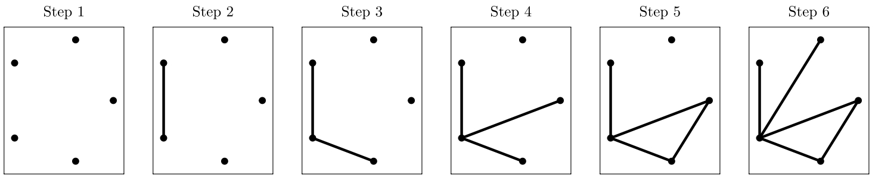{fig-align="center"}


## Backward Stepwise Algorithm

- Begins with a complete graph.
- Removes edges one at a time, selecting the edge that maximizes improvement in fit.

- Stops when no further enhancement in fit is achieved.


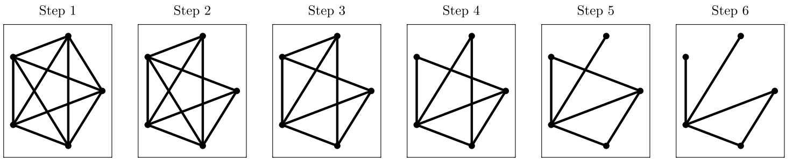{fig-align="center"}

## Simulated Annealing Algorithm {.smaller} 
<!-- - $H^* = \max_{G \in \mathcal{G}} \{H(G)\}.$ -->

<!-- - $\mathcal{H} = \{G \in \mathcal{G} : H(G) = H^*\}.$ -->

- $H(G) = \log \widehat L(G) - \lambda_n \sum_{v \in V} |A|^{|G(v)|}.$

- Definition of a neighbor of a graph.

::: {layout-ncol=3}
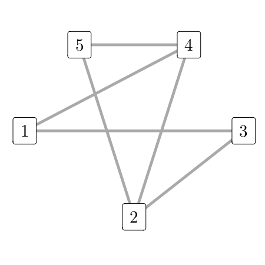 

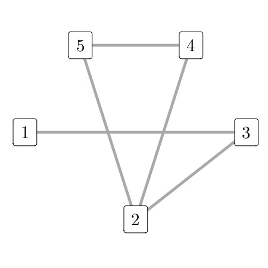

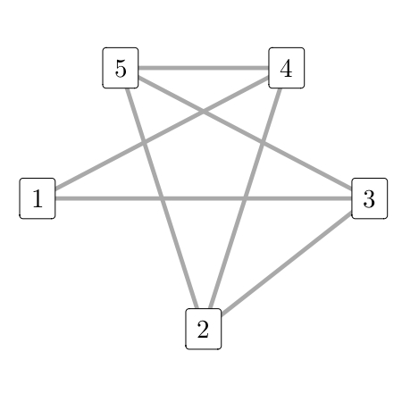 
:::

<!-- ## Simulated Annealing Algorithm {.smaller}  -->
<!-- - **Algorithm Overview**: -->
<!--   - Initialize with $G_1 \in \mathcal{G}$. -->
<!--   - Randomly choose neighbors $G_n^\prime$. -->
<!--   - Transition based on a probability formula. -->
<!--   - Repeat for $m$ iterations. -->
<!-- - **Parameter Choices**: -->
<!--   - $m$: Number of iterations. -->
<!--   - $C$: Constant in $\eta_n = C\log(1+n).$ -->
<!--   - Initial state $G_1$. -->
<!-- - Further details in Ross (2006). -->


## The MixingGraph R package

:::: {.columns}

::: {.column width="25%"}
{fig-align="center" width=200px}

:::

::: {.column width="75%"}

- Includes functions to compute the penalized log pseudo-likelihood function.

- Implements the four algorithms considered for estimation: exact, forward and backward stepwise, and simulated annealing.

:::
::::

- Offers examples on how to use the package.

- Available at [github.com/magnotairone/MixingGraph](https://github.com/magnotairone/MixingGraph/).

# Simulation Study

## Simulation Study {.smaller} 

- **Objective**: Assess the performance of the proposed algorithms via simulation studies.


- **Scenario 1: Fixed True Graph**
  - Generate synthetic data based on fixed true graph.
  - Assess estimator's performance under stability conditions.


- **Scenario 2: Random Graphs with Varying Edge Number** 
  - Generate random graphs with varying edge numbers.
  - Evaluate estimator's performance across graphs with different edge configuration.


## Example 11 - Scenario 1 {.smaller} 

- Consider  $\mathbf{X} = (X_1, \dots, X_5).$

- Joint probability function of these variables:
$$ p(x_1,x_2,x_3,x_4,x_5) = p(x_3) p(x_1|x_3) p(x_2|x_1,x_3) p(x_4|x_3) p(x_5|x_3). $$

:::: {.columns}

::: {.column width="40%"}
- Conditional probabilities:
``` {=tex}
\begin{align*} 
    p(x_1|x_2,x_3,x_4,x_5) &= p(x_1|x_2,x_3), \\  
    p(x_2|x_1,x_3,x_4,x_5) &= p(x_2|x_1,x_3), \\ 
    %p(x_3|x_1,x_2,x_4,x_5) &= p(x_1,x_2,x_3,x_4,x_5)/ \sum {_{x_3}}p(x_1,x_2,x_3,x_4,x_5), \\
    p(x_4|x_1,x_2,x_3,x_5) &= p(x_4|x_3), \\
    p(x_5|x_1,x_2,x_3,x_4)&= p(x_5|x_3).
\end{align*}
```
:::

::: {.column width="60%"}
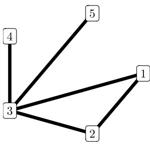{fig-align="center" width=250px}
:::
::::

- **Aim**: assess the performance of the algorithms for estimation.

- **Data generation**: Gibbs Sampler algorithm.

<!-- ## Example 11 - Data Generation {.smaller} -->

<!-- 0. Establish theoretical values for the marginal and conditional distributions. -->

<!-- 1. Initialize the variables -->
<!-- ``` {=tex} -->
<!-- \begin{align*}  -->
<!--     X_{3}^{0} &\sim p(X_3), &\qquad X_{1}^{0} &\sim p(X_1| X_{3}^{0}), \\ -->
<!--     X_{2}^{0} &\sim p(X_2| X_{1}^{0}, X_{3}^{0}), &\qquad X_{4}^{0} &\sim p(X_4| X_{3}^{0}), \\ -->
<!--     X_{5}^{0} &\sim p(X_5| X_{3}^{0}).  -->
<!-- \end{align*} -->
<!-- ``` -->


<!-- 2. For $j = 1, 2 \dots,$ generate -->
<!-- ``` {=tex}    -->
<!-- \begin{align*} -->
<!--     X_{1}^{j} &\sim p(X_1| X_{2}^{j-1}, X_{3}^{j-1}), &\qquad X_{2}^{j} &\sim p(X_2| X_{1}^{j}, X_{3}^{j-1}), \\ -->
<!--     X_{4}^{j} &\sim p(X_4| X_{3}^{j-1}), &\qquad X_{5}^{j} &\sim p(X_5| X_{3}^{j-1}), \\ -->
<!--     X_{3}^{j} &\sim p(X_3| X_{1}^{j}, X_{2}^{j}, X_{4}^{j}, X_{5}^{j}). -->
<!-- \end{align*} -->
<!-- ``` -->

<!-- Step 2 above should be repeated accordingly to generate a sample with the size needed. -->

<!-- ## Example 11 {.smaller} -->

<!-- TODO: pensar de incluo esse grafico -->

<!-- Effect of the penalizing constant value. -->

<!-- {fig-align="center"} -->

## Example 11 - Sampling Scheme {.smaller} 

- The Gibbs sampler (Geman and Geman, 1984 and Gelfand and Smith, 1990):
  - iterations: $15{,}000$, 
  - burn-in period: $5{,}000$,
  - final sample: $10{,}000$.

- Smaller samples were extracted from the initial sample $s_1, \dots, s_{10{,}000}$, with sizes $N \in \{100, 500, 1{,}000, 5{,}000, 10{,}000\}$.

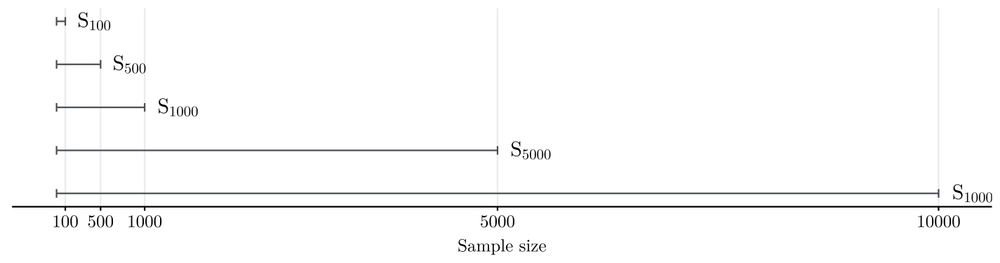{fig-align="center"}


## Example 11 - Exact Algorithm {.smaller}

Effects of sample size and penalizing constant value.
Here, $\lambda_N = c\log N.$
{fig-align="center"}

## Example 11 - Forward Stepwise {.smaller}

Effects of sample size and penalizing constant value.
Here, $\lambda_N = c\log N.$
{fig-align="center"}

## Example 11 - Backward Stepwise {.smaller}

Effects of sample size and penalizing constant value.
Here, $\lambda_N = c\log N.$
{fig-align="center"}

## Example 11 - Simulated Annealing {.smaller}

Effects of sample size and penalizing constant value.
Here, $\lambda_N = c\log N.$
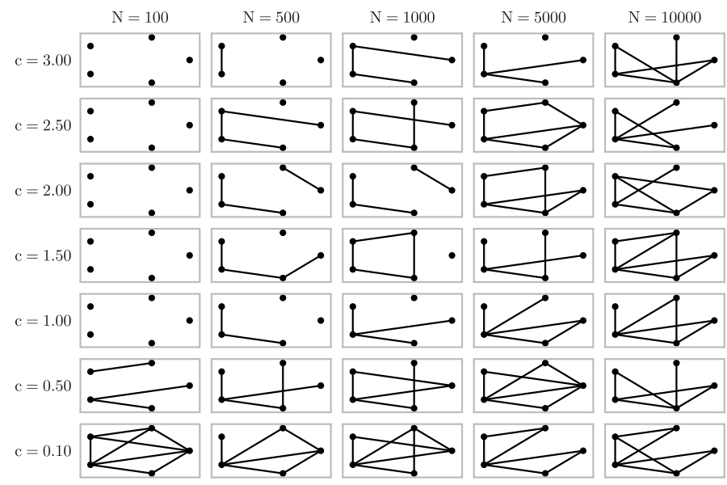{fig-align="center"}


<!-- adicionar comentarios -->

## Example 11 - Several Replications{.smaller}

- **Objective**: generate several samples and assess the performance of the algorithms.

- **Metrics**: underestimation error ($ue$), overestimation error ($oe$), and total error ($te$).

:::{#title-slide .center}
$ue(G, \hat G) = \frac{\sum_{(v, w)}\mathbf{1}\{(v, w)\in E \text{ and } (v,w) \not\in \hat E\}}{\sum_{(v, w)}\mathbf{1}\{(v, w) \in E\}},$
<br><br>
$oe(G, \hat G) = \frac{\sum_{(v, w)}\mathbf{1}\{(v, w)\not\in E \text{ and } (v,w) \in \hat E\}}{\sum_{(v, w)}\mathbf{1}\{(v, w) \not\in E\}},$
<br><br>
$\qquad \qquad te(G, \hat G) = \frac{ue \sum_{(v, w)}\mathbf{1}\{(v, w) \not\in E\} + oe \sum_{(v, w)}\mathbf{1}\{(v, w) \in E\}}{|V|(|V|-1)/2}.$
:::


## Example 11 - Several Replications {.smaller}

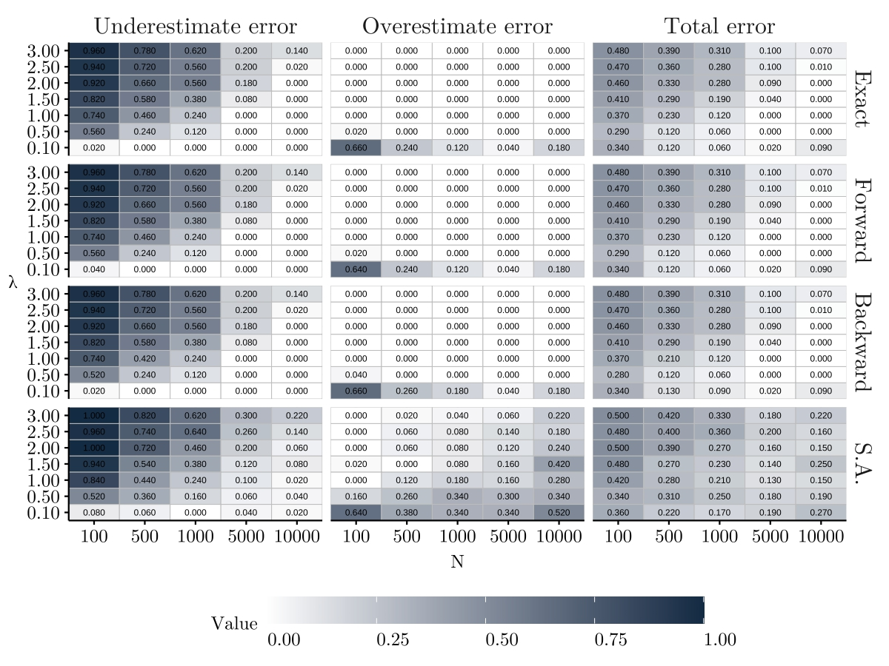{fig-align="center" width=100%}

<!-- - Stepwise algorithms offer appealing alternatives to Exact algorithm. -->
<!-- - Simulated Annealing results are unsatisfactory, favoring Forward or Backward Stepwise algorithms for practical applications. -->


## The Choice of Penalizing Constant $c$  {.smaller}

Utilize $k$-fold cross-validation to assess model performance and select optimal penalizing constant values.

```{r, engine = 'tikz', fig.align='center', out.height='300px'}
% Created by tikzDevice version 0.12.4 on 2024-04-04 09:23:38
% !TEX encoding = UTF-8 Unicode
\begin{tikzpicture}[x=1pt,y=1pt]
\definecolor{fillColor}{RGB}{255,255,255}
\path[use as bounding box,fill=fillColor,fill opacity=0.00] (0,0) rectangle (361.35,144.54);
\begin{scope}
\path[clip] ( 51.29,  8.25) rectangle (355.85,139.04);
\definecolor{drawColor}{RGB}{0,0,0}
\definecolor{fillColor}{RGB}{102,194,165}

\path[draw=drawColor,line width= 0.6pt,fill=fillColor,fill opacity=0.80] ( 65.13, 14.20) rectangle (120.51, 37.51);

\path[draw=drawColor,line width= 0.6pt,fill=fillColor,fill opacity=0.80] (120.51, 14.20) rectangle (175.88, 37.51);

\path[draw=drawColor,line width= 0.6pt,fill=fillColor,fill opacity=0.80] (175.88, 14.20) rectangle (231.26, 37.51);

\path[draw=drawColor,line width= 0.6pt,fill=fillColor,fill opacity=0.80] (231.26, 14.20) rectangle (286.63, 37.51);
\definecolor{fillColor}{RGB}{252,141,98}

\path[draw=drawColor,line width= 0.6pt,fill=fillColor,fill opacity=0.80] (286.63, 14.20) rectangle (342.01, 37.51);
\definecolor{fillColor}{RGB}{102,194,165}

\path[draw=drawColor,line width= 0.6pt,fill=fillColor,fill opacity=0.80] ( 65.13, 39.84) rectangle (120.51, 60.82);

\path[draw=drawColor,line width= 0.6pt,fill=fillColor,fill opacity=0.80] (120.51, 39.84) rectangle (175.88, 60.82);

\path[draw=drawColor,line width= 0.6pt,fill=fillColor,fill opacity=0.80] (175.88, 39.84) rectangle (231.26, 60.82);
\definecolor{fillColor}{RGB}{252,141,98}

\path[draw=drawColor,line width= 0.6pt,fill=fillColor,fill opacity=0.80] (231.26, 39.84) rectangle (286.63, 60.82);
\definecolor{fillColor}{RGB}{102,194,165}

\path[draw=drawColor,line width= 0.6pt,fill=fillColor,fill opacity=0.80] (286.63, 39.84) rectangle (342.01, 60.82);

\path[draw=drawColor,line width= 0.6pt,fill=fillColor,fill opacity=0.80] ( 65.13, 63.15) rectangle (120.51, 84.14);

\path[draw=drawColor,line width= 0.6pt,fill=fillColor,fill opacity=0.80] (120.51, 63.15) rectangle (175.88, 84.14);
\definecolor{fillColor}{RGB}{252,141,98}

\path[draw=drawColor,line width= 0.6pt,fill=fillColor,fill opacity=0.80] (175.88, 63.15) rectangle (231.26, 84.14);
\definecolor{fillColor}{RGB}{102,194,165}

\path[draw=drawColor,line width= 0.6pt,fill=fillColor,fill opacity=0.80] (231.26, 63.15) rectangle (286.63, 84.14);

\path[draw=drawColor,line width= 0.6pt,fill=fillColor,fill opacity=0.80] (286.63, 63.15) rectangle (342.01, 84.14);

\path[draw=drawColor,line width= 0.6pt,fill=fillColor,fill opacity=0.80] ( 65.13, 86.47) rectangle (120.51,107.45);
\definecolor{fillColor}{RGB}{252,141,98}

\path[draw=drawColor,line width= 0.6pt,fill=fillColor,fill opacity=0.80] (120.51, 86.47) rectangle (175.88,107.45);
\definecolor{fillColor}{RGB}{102,194,165}

\path[draw=drawColor,line width= 0.6pt,fill=fillColor,fill opacity=0.80] (175.88, 86.47) rectangle (231.26,107.45);

\path[draw=drawColor,line width= 0.6pt,fill=fillColor,fill opacity=0.80] (231.26, 86.47) rectangle (286.63,107.45);

\path[draw=drawColor,line width= 0.6pt,fill=fillColor,fill opacity=0.80] (286.63, 86.47) rectangle (342.01,107.45);
\definecolor{fillColor}{RGB}{252,141,98}

\path[draw=drawColor,line width= 0.6pt,fill=fillColor,fill opacity=0.80] ( 65.13,109.78) rectangle (120.51,133.10);
\definecolor{fillColor}{RGB}{102,194,165}

\path[draw=drawColor,line width= 0.6pt,fill=fillColor,fill opacity=0.80] (120.51,109.78) rectangle (175.88,133.10);

\path[draw=drawColor,line width= 0.6pt,fill=fillColor,fill opacity=0.80] (175.88,109.78) rectangle (231.26,133.10);

\path[draw=drawColor,line width= 0.6pt,fill=fillColor,fill opacity=0.80] (231.26,109.78) rectangle (286.63,133.10);

\path[draw=drawColor,line width= 0.6pt,fill=fillColor,fill opacity=0.80] (286.63,109.78) rectangle (342.01,133.10);

\node[text=drawColor,anchor=base,inner sep=0pt, outer sep=0pt, scale=  1.10] at ( 92.82,116.47) {Val.};

\node[text=drawColor,anchor=base,inner sep=0pt, outer sep=0pt, scale=  1.10] at (148.19, 93.16) {Val.};

\node[text=drawColor,anchor=base,inner sep=0pt, outer sep=0pt, scale=  1.10] at (203.57, 69.84) {Val.};

\node[text=drawColor,anchor=base,inner sep=0pt, outer sep=0pt, scale=  1.10] at (258.94, 46.53) {Val.};

\node[text=drawColor,anchor=base,inner sep=0pt, outer sep=0pt, scale=  1.10] at (314.32, 23.22) {Val.};

\node[text=drawColor,anchor=base,inner sep=0pt, outer sep=0pt, scale=  1.10] at ( 92.82, 23.22) {Train};

\node[text=drawColor,anchor=base,inner sep=0pt, outer sep=0pt, scale=  1.10] at (148.19, 23.22) {Train};

\node[text=drawColor,anchor=base,inner sep=0pt, outer sep=0pt, scale=  1.10] at (203.57, 23.22) {Train};

\node[text=drawColor,anchor=base,inner sep=0pt, outer sep=0pt, scale=  1.10] at (258.94, 23.22) {Train};

\node[text=drawColor,anchor=base,inner sep=0pt, outer sep=0pt, scale=  1.10] at ( 92.82, 46.53) {Train};

\node[text=drawColor,anchor=base,inner sep=0pt, outer sep=0pt, scale=  1.10] at (148.19, 46.53) {Train};

\node[text=drawColor,anchor=base,inner sep=0pt, outer sep=0pt, scale=  1.10] at (203.57, 46.53) {Train};

\node[text=drawColor,anchor=base,inner sep=0pt, outer sep=0pt, scale=  1.10] at (314.32, 46.53) {Train};

\node[text=drawColor,anchor=base,inner sep=0pt, outer sep=0pt, scale=  1.10] at ( 92.82, 69.84) {Train};

\node[text=drawColor,anchor=base,inner sep=0pt, outer sep=0pt, scale=  1.10] at (148.19, 69.84) {Train};

\node[text=drawColor,anchor=base,inner sep=0pt, outer sep=0pt, scale=  1.10] at (258.94, 69.84) {Train};

\node[text=drawColor,anchor=base,inner sep=0pt, outer sep=0pt, scale=  1.10] at (314.32, 69.84) {Train};

\node[text=drawColor,anchor=base,inner sep=0pt, outer sep=0pt, scale=  1.10] at ( 92.82, 93.16) {Train};

\node[text=drawColor,anchor=base,inner sep=0pt, outer sep=0pt, scale=  1.10] at (203.57, 93.16) {Train};

\node[text=drawColor,anchor=base,inner sep=0pt, outer sep=0pt, scale=  1.10] at (258.94, 93.16) {Train};

\node[text=drawColor,anchor=base,inner sep=0pt, outer sep=0pt, scale=  1.10] at (314.32, 93.16) {Train};

\node[text=drawColor,anchor=base,inner sep=0pt, outer sep=0pt, scale=  1.10] at (148.19,116.47) {Train};

\node[text=drawColor,anchor=base,inner sep=0pt, outer sep=0pt, scale=  1.10] at (203.57,116.47) {Train};

\node[text=drawColor,anchor=base,inner sep=0pt, outer sep=0pt, scale=  1.10] at (258.94,116.47) {Train};

\node[text=drawColor,anchor=base,inner sep=0pt, outer sep=0pt, scale=  1.10] at (314.32,116.47) {Train};
\end{scope}
\begin{scope}
\path[clip] (  0.00,  0.00) rectangle (361.35,144.54);
\definecolor{drawColor}{gray}{0.30}

\node[text=drawColor,anchor=base east,inner sep=0pt, outer sep=0pt, scale=  0.88] at ( 46.34, 23.99) {Iteration 5};

\node[text=drawColor,anchor=base east,inner sep=0pt, outer sep=0pt, scale=  0.88] at ( 46.34, 47.30) {Iteration 4};

\node[text=drawColor,anchor=base east,inner sep=0pt, outer sep=0pt, scale=  0.88] at ( 46.34, 70.61) {Iteration 3};

\node[text=drawColor,anchor=base east,inner sep=0pt, outer sep=0pt, scale=  0.88] at ( 46.34, 93.93) {Iteration 2};

\node[text=drawColor,anchor=base east,inner sep=0pt, outer sep=0pt, scale=  0.88] at ( 46.34,117.24) {Iteration 1};
\end{scope}
\end{tikzpicture}

```

. . .

Compute pseudo-log-likelihood over validation sets for different constant values.
\begin{equation}
  \mathrm{CV}_k^{(i)}(c) = \sum_{v \in V} \:\sum_{(a_v\in A)} \:\sum_{a_{\hat G(v)}\in A^{|\hat G(v)|}}
          N_i(a_v,a_{\widehat G(v)})\log \widehat\pi(a_v|a_{\widehat G(v)})\,.
\end{equation}

<!-- ## The Choice of Penalizing Constant $c$  {.smaller} -->

<!-- - **Issue:** Configuration mismatch between training and validation sets can cause problems in cross-validation. -->
<!--    $$\hat\pi(a_v|a_{\hat G(v)}) = 0, \text{ resulting in } \mathrm{CV}_k^{(i)}(c) = -\infty.$$  -->
<!-- - **Solution:** Introduce the hyperparameter $\gamma$ to handle cases where observed configuration is absent in training set, -->
<!--    $$\hat\pi(a_v|a_{\hat G(v)}) = \gamma.$$ -->
<!-- - **Redefinition:** Rescale distribution $\hat\pi(\cdot|a_{\hat G(v)})$ for configurations not seen in training data. -->
<!-- - **Recommendation:** Set $\gamma$ to a small value for numerical stability. -->
<!-- - This change ensures stability and reliability of cross-validation method for real-world datasets. -->

## The Choice of Penalizing Constant $c$  {.smaller}

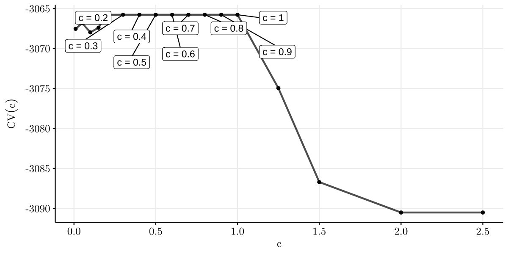{fig-align="center"}

$5$-fold cross-validation error for Example 11, considering a sample of size $5{,}000$ and set of values for penalizing constant.


## Example 12 - Scenario 2 {.smaller}

- **Objective**: Assess algorithms across diverse random scenarios to understand their performance.

- **Methodology**:
  - Gerante random graphs with fixed number of nodes and different number of edges.
  - Generate samples of size $N=5{,}000$.
  - Evaluate Exact, Simulated Annealing, Forward Stepwise, and Backward Stepwise algorithms.
  - Vary penalizing constant values $c = \{0.1, 0.5,$ $1.0, 1.5, 2.0, 2.5, 3.0\}.$

## Example 12: Random Graphs {.smaller}

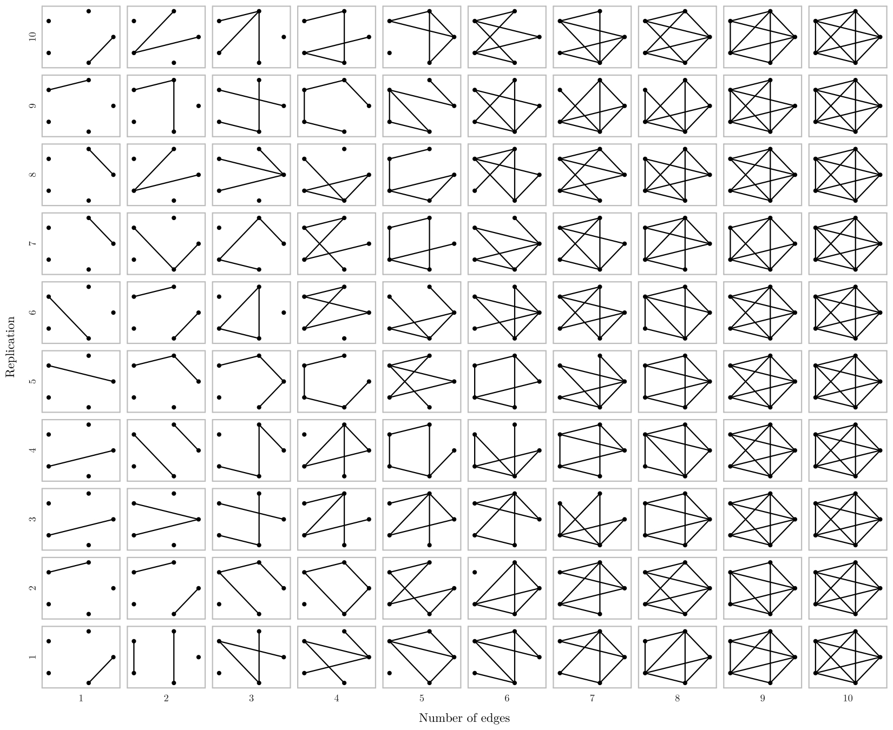{width=90% fig-align="center"}

<!-- ## Example 12 - Forward Stepwise {.smaller} -->
<!-- 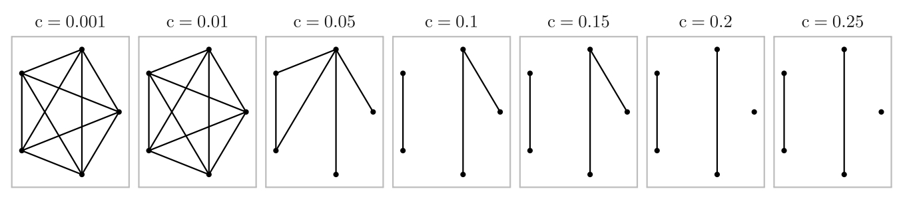{fig-align="center"} -->
<!-- add legenda -->

## Example 12: Random Graphs {.smaller}

Average error metrics outcomes of the forward stepwise algorithm as function of penalizing constant.
<!-- Each sub-figure represents the result of a specific $c$ value and displays the averaged errors as a function of the number of edges in the graph. -->

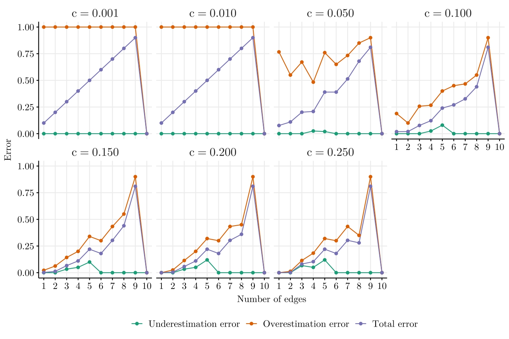{fig-align="center"}


## Example 12: Random Graphs {.smaller}

Average error metrics outcomes of the forward stepwise algorithm as function of the number of nodes in the graph.

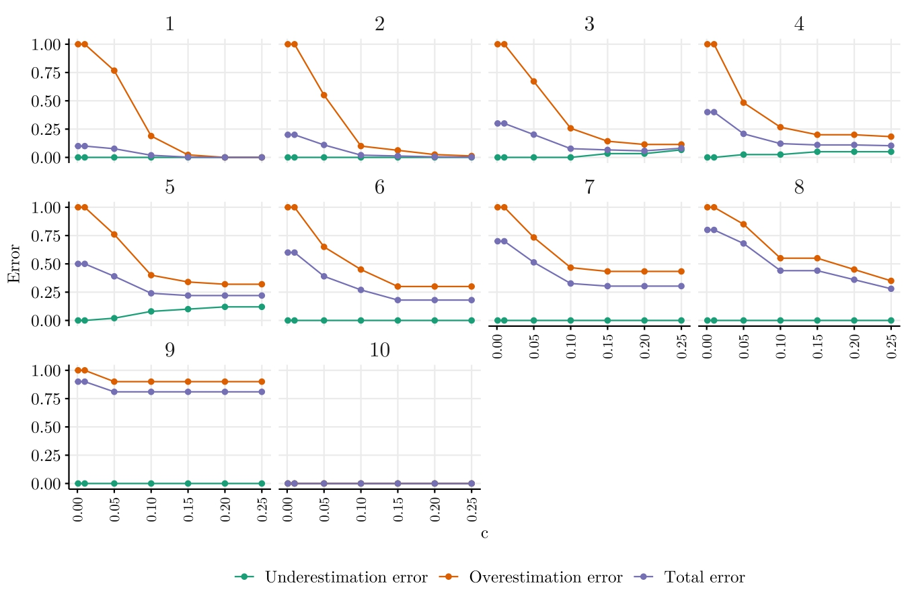{fig-align="center"}

<!-- Effect of varying the penalizing constant $c$ on the average error metrics outcomes from the forward stepwise algorithm.  -->
<!-- Each subfigure is the result given by graphs with a fixed number of edges, from 1 to 10. -->


# Application to real data


## São Francisco River Data {.smaller}

:::: {.columns}

::: {.column width="50%"}
{fig-align="center"}
:::
::: {.column width="50%"}
{fig-align="center"}
:::
::::

## São Francisco River Data {.smaller}

- Water volume measured at $d$ stations along the river's course.

- Stations denoted as $X_{u}$, where $u = 1, \ldots, d$.

- Vector $\mathbf{X}$ observed at discrete time intervals (10-day mean).

- Each observation denoted as $\mathbf{X}^{(i)}= (X_{1}^{(i)}, \ldots, X_{d}^{(i)})$.

- Process $\mathbf{X}^n=\{\mathbf{X}^{(i)}: 1 \leq i \leq n\}$.

## São Francisco River Data {.smaller}

- **Data avaiability**: daily measurements from October 1st, 1924, to February 28th, 2019.

- **Data considered**: from January 1977 to December 2016.

- Total of 1042 observations.

- **Discretizetion** of the data into five levels based on quantiles.


{width=70% fig-align="center"}

<!-- ## São Francisco River Data {.smaller} -->

<!-- {fig-align="center"}. -->

<!-- Stream flow volume measured at the ten stations in the SFR (logarithmic scale). -->

## São Francisco River Data {.smaller}

Forward stepwise algorithm and a $5$-fold cross-validation approach.


:::: {.columns}
::: {.column width="50%"}
{fig-align="center"}
:::
::: {.column width="50%"}
{fig-align="center"}
:::
::::

Results similar to Leonardi et al (2021).

## Stock Exchange Data {.smaller}

:::: {.columns}

::: {.column width="45%"}
<br/>

- Relation between stock exchanges' performance reflect global market interconnectedness and economic trends.

- Impacts investment strategies, risk assessment, and portfolio diversification.

- **Challenge**: Variations in stock exchange operating hours due to different time zones.

- Complex analysis required to account for global market fluctuations.
:::

::: {.column width="55%"}
{fig-align="center"}
:::

:::

## Stock Exchange Data {.smaller}

- **Objective**: analyse the Relation between stock exchanges' performance.

- **Discretization**: daily indicator of an increase in the index rate.

- Data from May 18th, 2010 to September 20th, 2023.

- Adjustments made to address missing data and holiday schedules.
 
- Final dataset comprises $2{,}654$ rows for analysis.

- Forward stepwise algorithm and a $5$-fold cross-validation approach.


<!-- ## Stock Exchange Data {.smaller} -->

<!-- {fig-align="center"} -->

<!-- $5$-fold cross-validation error. -->

## Stock Exchange Data {.smaller}

{fig-align="center"}

Estimated graph, considering the penalizing constant value chosen by cross-validation.

## Conclusion and Future Work {.smaller}

- Motivated by Leonardi et al. (2021) and Leonardi et al. (2023).
- Introduced a penalized pseudo-likelihood criterion to perform graph estimation for process under mixing conditions.
- Developed method for estimating entire graph $G$.
- Proved consistency and convergence rate of the estimator.
- Explored implementation approaches: exact, stepwise, and simulated annealing.
- Conducted simulation study to evaluate effectiveness.
- Showed analysis and application to real-world data.

- **Future Work**:
  
  - Generalize approach for continuous multivariate stochastic processes.
  - Extend methodology to infinite vertex sets and unbounded estimators.
  - Adapt model to estimate direction of edges for directed graphs.

## References {.smaller}

::: {style="font-size: 80%;"}

- Cerqueira et al.(2017) Andressa Cerqueira, Daniel Fraiman, Claudia D. Vargas and Florencia Leonardi. **A test of hypotheses for random graph distributions built from eeg data**. *IEEE Transactions on Network Science and Engineering*, 4(2):75-82.

- Galves et al.(2015) Antonio Galves, Enza Orlandi and Daniel Y. Takahashi. **Identifying interacting pairs of sites in Ising models on a countable set**. *Braz. J. Probab. Stat.*, 29(2):443-459.

- Lauritzen(1996) Steffen L Lauritzen. **Graphical models**, volume 17. *Clarendon Press*.

- Leonardi et al.(2021) Florencia Leonardi, Matías Lopez-Rosenfeld, Daniela Rodriguez, Magno TF Severino and Mariela Sued. **Independent block identification in multivariate time series**. *Journal of Time Series Analysis*, 42(1):19-33.

- Leonardi et al.(2023) Florencia Leonardi, Rodrigo Carvalho and Iara Frondana. **Structure recovery for partially observed discrete markov random fields on graphs under not necessarily positive distributions**. *Scandinavian Journal of Statistics*.

- Meinshausen and Bühlmann(2006) N. Meinshausen and P. Bühlmann. **Highdimensional graphs and variable selection with the lasso**. *Ann. Statist.*, 34(3):1436-1462.

- Ravikumar et al.(2010) Pradeep Ravikumar, Martin J. Wainwright and John D. Lafferty. **High-dimensional Ising model selection using l1-regularized logistic regression**. *Ann. Statist.*, 38(3):3022-1319.

:::

## 
<br/><br/><br/>

<h1 style="text-align: center"> Thank you! </h1>
<h1 style="text-align: center"> Obrigado! </h1>
<h1 style="text-align: center"> ¡Gracias! </h1>