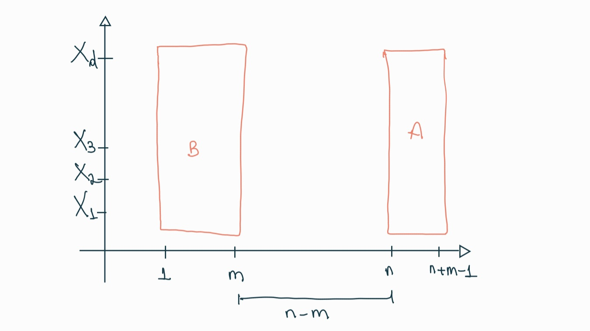
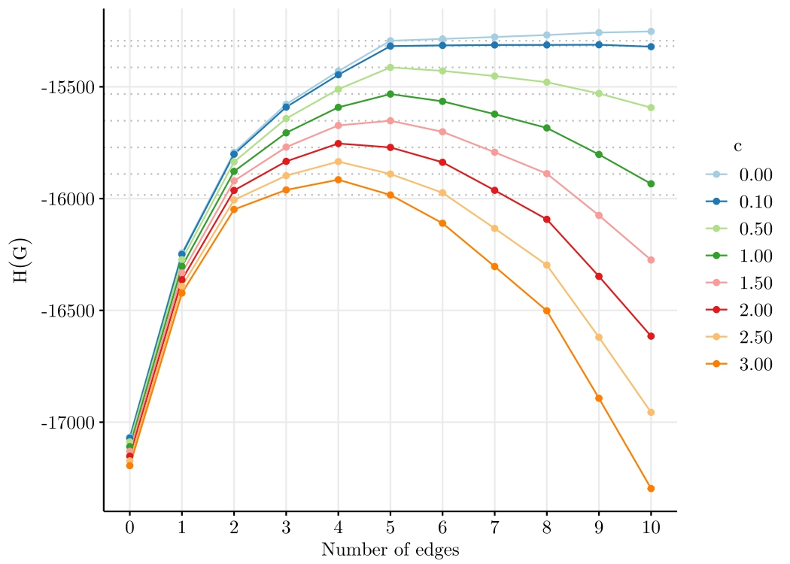
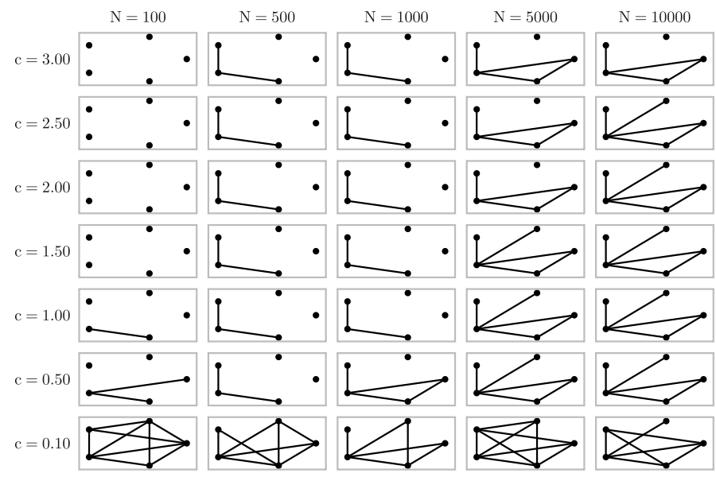
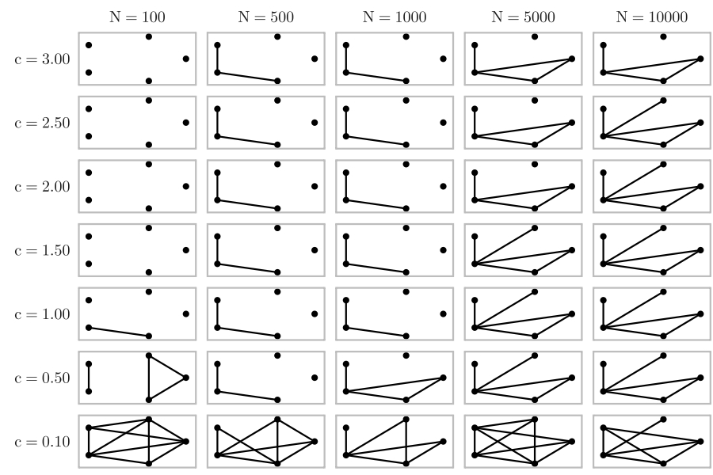
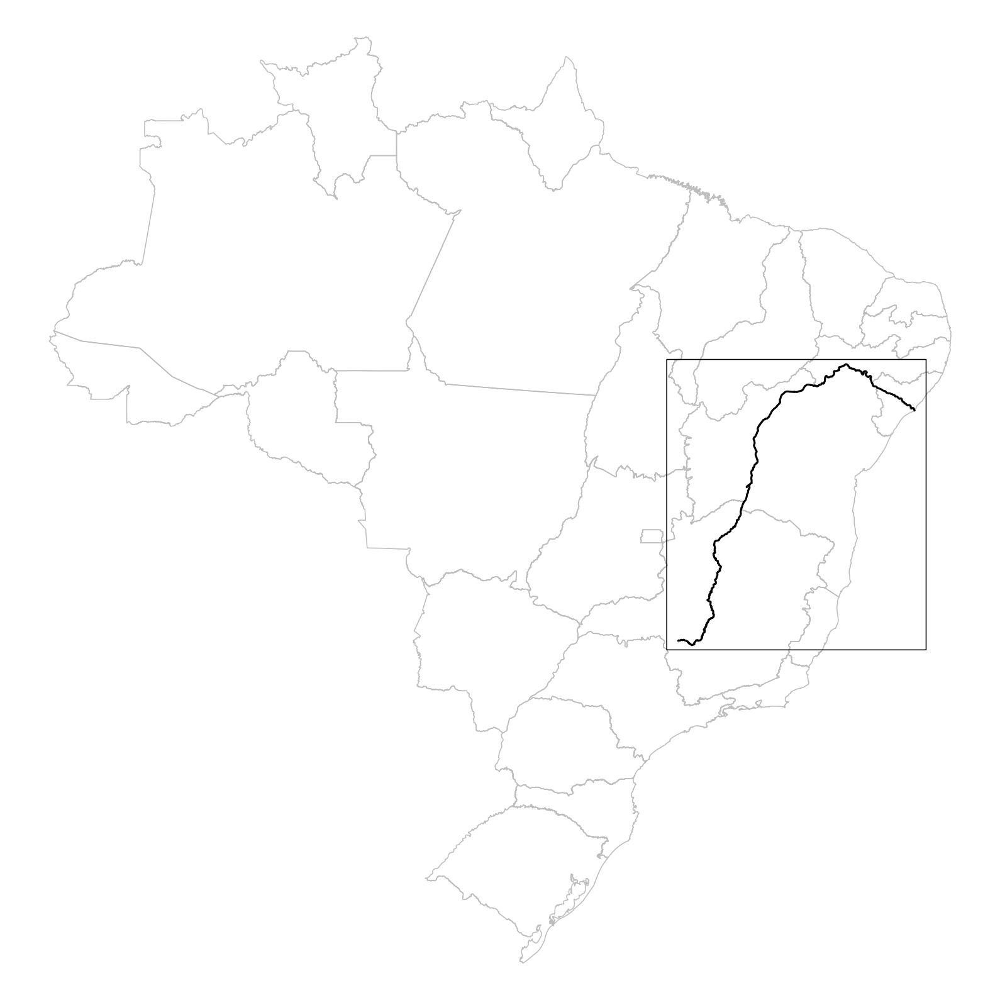
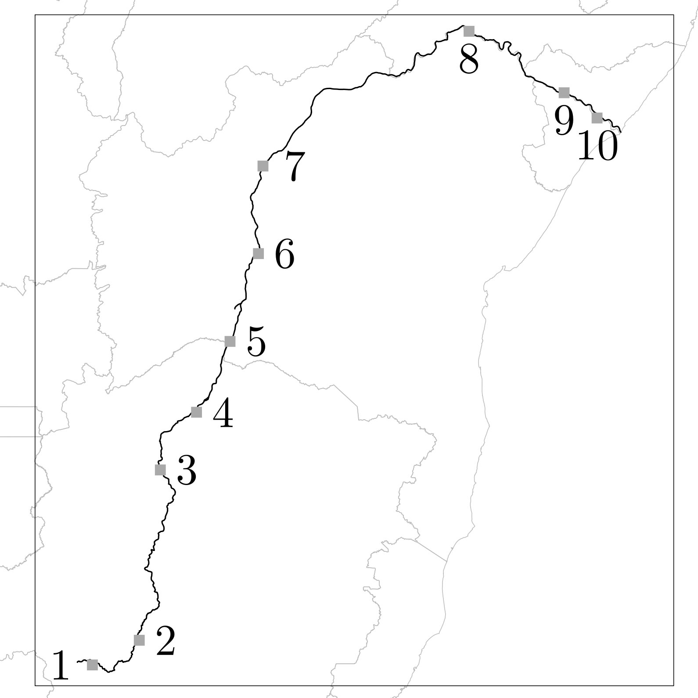
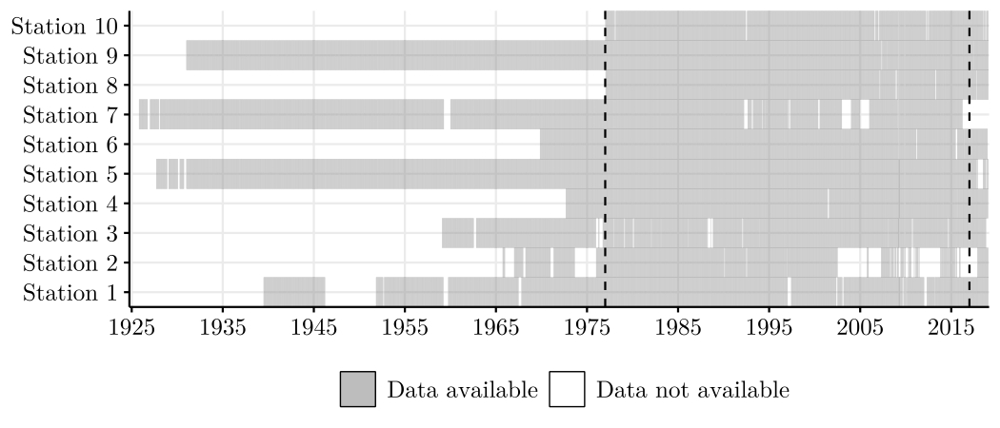
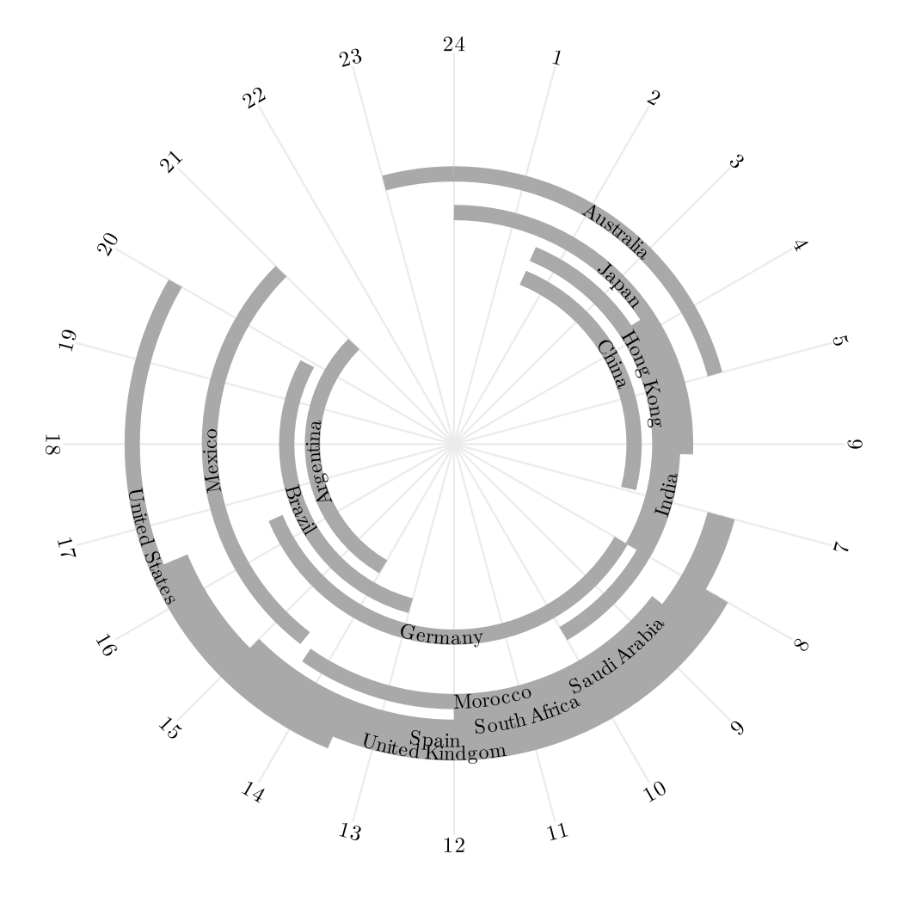
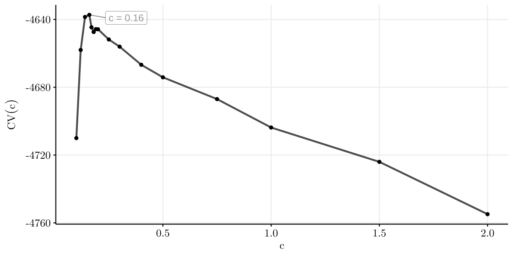
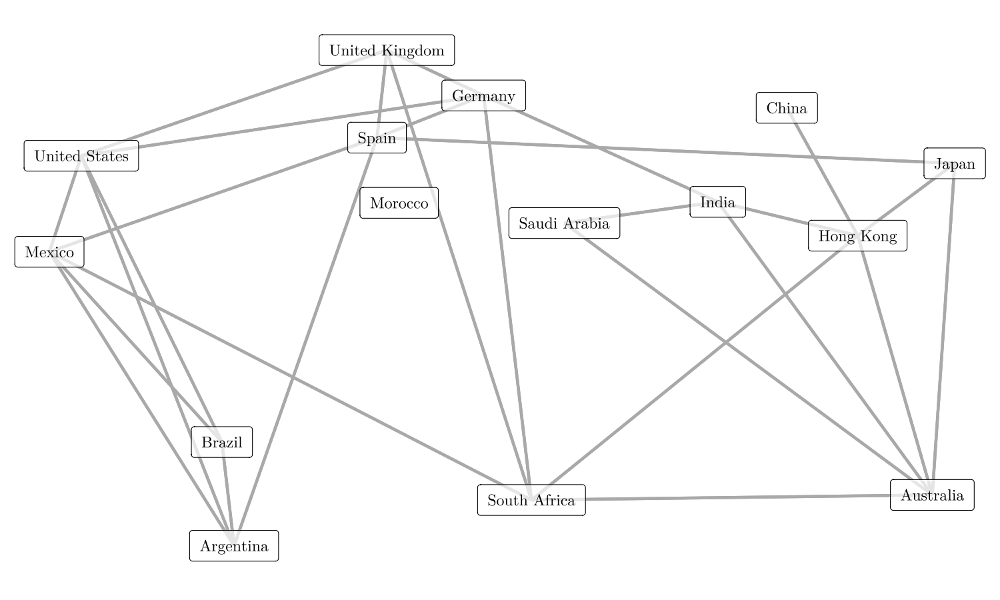

## Model selection for Markov random fields on graphs under a mixing condition {style="font-size: 1.3em; margin-bottom: 140px;"}

### Magno Severino & Florencia Leonardi {style="font-size: 0.9em; color:#666666; margin-top: 45px; margin-bottom: 45px;"}

### Seminário Acadêmico de Ciência de Dados {style="font-size: 0.8em; color:darkgray;"}

### 2026-05-07 {style="font-size: 0.8em; color:darkgray;"}

## Agenda

-  **Motivation**
    
-  **Mathematical Framework**
    
-  **Estimation Method** and  **Theoretical Results**
    
- **Simulations**

-  **Applications to real data**

-  **Discussion and Future Work**

## Vector-Valued Stochastic Processes {.smaller}

- $\bf X^{(i)} = \big(X_1^{(i)}, X_2^{(i)}, \dots, X_d^{(i)}\big).$

- $X_v^{(i)} \in A,$ $A$ a finite alphabet, for $v \in \{1,2,\dots,d\}.$

- Stationary and ergodic process $\bf X = \{X^{(i)}: -\infty<i<\infty\}$ in $\big((A^d)^\mathbb N, \mathcal F, \mathbb P\big)$ with invariant distribution $\pi.$

- We assume the process $\bf X$ has an underlying graph $G^* = (V, E^*)$ encoding the conditional dependencies in $\pi$.

```{r, engine = 'tikz', fig.align='center', fig.width=6, fig.height=3.5, out.width="75%"}
% Created by tikzDevice version 0.12.4 on 2024-03-25 21:10:44
% !TEX encoding = UTF-8 Unicode
\begin{tikzpicture}[x=1pt,y=1pt]
\definecolor{fillColor}{RGB}{255,255,255}
\path[use as bounding box,fill=fillColor,fill opacity=0.00] (0,0) rectangle (361.35,216.81);
\begin{scope}
\path[clip] (  0.00,  0.00) rectangle (361.35,216.81);
\definecolor{drawColor}{RGB}{255,255,255}
\definecolor{fillColor}{RGB}{255,255,255}

\path[draw=drawColor,line width= 0.6pt,line join=round,line cap=round,fill=fillColor] (  0.00,  0.00) rectangle (361.35,216.81);
\end{scope}
\begin{scope}
\path[clip] ( 40.82, 37.04) rectangle (355.85,211.31);
\definecolor{fillColor}{RGB}{255,255,255}

\path[fill=fillColor] ( 40.82, 37.04) rectangle (355.85,211.31);
\definecolor{drawColor}{RGB}{0,0,0}

\node[text=drawColor,anchor=base,inner sep=0pt, outer sep=0pt, scale=  1.10] at ( 81.18, 60.97) {$x_1^{(1)}$};

\node[text=drawColor,anchor=base,inner sep=0pt, outer sep=0pt, scale=  1.10] at ( 81.18,100.57) {$x_2^{(1)}$};

\node[text=drawColor,anchor=base,inner sep=0pt, outer sep=0pt, scale=  1.10] at ( 81.18,179.78) {$x_d^{(1)}$};

\node[text=drawColor,anchor=base,inner sep=0pt, outer sep=0pt, scale=  1.10] at (133.25, 60.97) {$x_1^{(2)}$};

\node[text=drawColor,anchor=base,inner sep=0pt, outer sep=0pt, scale=  1.10] at (133.25,100.57) {$x_2^{(2)}$};

\node[text=drawColor,anchor=base,inner sep=0pt, outer sep=0pt, scale=  1.10] at (133.25,179.78) {$x_d^{(2)}$};

\node[text=drawColor,anchor=base,inner sep=0pt, outer sep=0pt, scale=  1.10] at (185.32, 60.97) {$x_1^{(3)}$};

\node[text=drawColor,anchor=base,inner sep=0pt, outer sep=0pt, scale=  1.10] at (185.32,100.57) {$x_2^{(3)}$};

\node[text=drawColor,anchor=base,inner sep=0pt, outer sep=0pt, scale=  1.10] at (185.32,179.78) {$x_d^{(3)}$};

\node[text=drawColor,anchor=base,inner sep=0pt, outer sep=0pt, scale=  1.10] at (289.46, 60.97) {$x_1^{(n)}$};

\node[text=drawColor,anchor=base,inner sep=0pt, outer sep=0pt, scale=  1.10] at (289.46,100.57) {$x_2^{(n)}$};

\node[text=drawColor,anchor=base,inner sep=0pt, outer sep=0pt, scale=  1.10] at (289.46,179.78) {$x_d^{(n)}$};

\node[text=drawColor,anchor=base,inner sep=0pt, outer sep=0pt, scale=  1.10] at (237.39, 60.97) {$\dots$};

\node[text=drawColor,anchor=base,inner sep=0pt, outer sep=0pt, scale=  1.10] at (237.39,100.57) {$\dots$};

\node[text=drawColor,anchor=base,inner sep=0pt, outer sep=0pt, scale=  1.10] at (237.39,140.18) {$\dots$};

\node[text=drawColor,anchor=base,inner sep=0pt, outer sep=0pt, scale=  1.10] at (237.39,179.78) {$\dots$};

\node[text=drawColor,anchor=base,inner sep=0pt, outer sep=0pt, scale=  1.10] at ( 81.18,140.18) {$\vdots$};

\node[text=drawColor,anchor=base,inner sep=0pt, outer sep=0pt, scale=  1.10] at (133.25,140.18) {$\vdots$};

\node[text=drawColor,anchor=base,inner sep=0pt, outer sep=0pt, scale=  1.10] at (185.32,140.18) {$\vdots$};

\node[text=drawColor,anchor=base,inner sep=0pt, outer sep=0pt, scale=  1.10] at (289.46,140.18) {$\vdots$};
\end{scope}
\begin{scope}
\path[clip] (  0.00,  0.00) rectangle (361.35,216.81);
\definecolor{drawColor}{RGB}{0,0,0}

\path[draw=drawColor,line width= 0.6pt,line join=round] ( 40.82, 37.04) --
	( 40.82,211.31);
\end{scope}
\begin{scope}
\path[clip] (  0.00,  0.00) rectangle (361.35,216.81);
\definecolor{drawColor}{gray}{0.30}

\node[text=drawColor,anchor=base east,inner sep=0pt, outer sep=0pt, scale=  1.20] at ( 35.87, 60.64) {$X_1$};

\node[text=drawColor,anchor=base east,inner sep=0pt, outer sep=0pt, scale=  1.20] at ( 35.87,100.24) {$X_2$};

\node[text=drawColor,anchor=base east,inner sep=0pt, outer sep=0pt, scale=  1.20] at ( 35.87,179.45) {$X_d$};
\end{scope}
\begin{scope}
\path[clip] (  0.00,  0.00) rectangle (361.35,216.81);
\definecolor{drawColor}{gray}{0.20}

\path[draw=drawColor,line width= 0.6pt,line join=round] ( 38.07, 64.77) --
	( 40.82, 64.77);

\path[draw=drawColor,line width= 0.6pt,line join=round] ( 38.07,104.37) --
	( 40.82,104.37);

\path[draw=drawColor,line width= 0.6pt,line join=round] ( 38.07,183.59) --
	( 40.82,183.59);
\end{scope}
\begin{scope}
\path[clip] (  0.00,  0.00) rectangle (361.35,216.81);
\definecolor{drawColor}{RGB}{0,0,0}

\path[draw=drawColor,line width= 0.6pt,line join=round] ( 40.82, 37.04) --
	(355.85, 37.04);
\definecolor{fillColor}{RGB}{0,0,0}

\path[draw=drawColor,line width= 0.6pt,line join=round,fill=fillColor] (347.19, 32.04) --
	(355.85, 37.04) --
	(347.19, 42.04) --
	cycle;
\end{scope}
\begin{scope}
\path[clip] (  0.00,  0.00) rectangle (361.35,216.81);
\definecolor{drawColor}{gray}{0.20}

\path[draw=drawColor,line width= 0.6pt,line join=round] ( 81.18, 34.29) --
	( 81.18, 37.04);

\path[draw=drawColor,line width= 0.6pt,line join=round] (133.25, 34.29) --
	(133.25, 37.04);

\path[draw=drawColor,line width= 0.6pt,line join=round] (185.32, 34.29) --
	(185.32, 37.04);

\path[draw=drawColor,line width= 0.6pt,line join=round] (289.46, 34.29) --
	(289.46, 37.04);
\end{scope}
\begin{scope}
\path[clip] (  0.00,  0.00) rectangle (361.35,216.81);
\definecolor{drawColor}{gray}{0.30}

\node[text=drawColor,anchor=base,inner sep=0pt, outer sep=0pt, scale=  1.20] at ( 81.18, 23.83) {1};

\node[text=drawColor,anchor=base,inner sep=0pt, outer sep=0pt, scale=  1.20] at (133.25, 23.83) {2};

\node[text=drawColor,anchor=base,inner sep=0pt, outer sep=0pt, scale=  1.20] at (185.32, 23.83) {3};

\node[text=drawColor,anchor=base,inner sep=0pt, outer sep=0pt, scale=  1.20] at (289.46, 23.83) {$n$};
\end{scope}
\begin{scope}
\path[clip] (  0.00,  0.00) rectangle (361.35,216.81);
\definecolor{drawColor}{RGB}{0,0,0}

\node[text=drawColor,anchor=base east,inner sep=0pt, outer sep=0pt, scale=  1.50] at (355.85,  8.42) {$t$};
\end{scope}
\begin{scope}
\path[clip] (  0.00,  0.00) rectangle (361.35,216.81);
\definecolor{drawColor}{RGB}{0,0,0}

\node[text=drawColor,anchor=base east,inner sep=0pt, outer sep=0pt, scale=  1.50] at ( 17.58,200.98) {$V$};
\end{scope}
\end{tikzpicture}

```

<!-- ::: {.callout-important} -->
<!-- Unlike lattice models (regular grids), the graph $G^*$ in this framework is general and non-homogeneous. -->
<!-- ::: -->


## Vector-Valued Stochastic Processes {.smaller}

- $\bf X^{(i)} = \big(X_1^{(i)}, X_2^{(i)}, \dots, X_d^{(i)}\big).$

- $X_v^{(i)} \in A,$ $A$ a finite alphabet, for $v \in \{1,2,\dots,d\}.$

- Stationary and ergodic process $\bf X = \{X^{(i)}: -\infty<i<\infty\}$ in $\big((A^d)^\mathbb N, \mathcal F, \mathbb P\big)$  with invariant distribution $\pi.$

- We assume the process $\bf X$ has an underlying graph $G^* = (V, E^*)$ encoding the conditional dependencies in $\pi$.

```{r, engine = 'tikz', fig.align='center', fig.width=6, fig.height=3.5, out.width="75%"}
% Created by tikzDevice version 0.12.4 on 2024-03-25 21:11:34
% !TEX encoding = UTF-8 Unicode
\begin{tikzpicture}[x=1pt,y=1pt]
\definecolor{fillColor}{RGB}{255,255,255}
\path[use as bounding box,fill=fillColor,fill opacity=0.00] (0,0) rectangle (361.35,216.81);
\begin{scope}
\path[clip] (  0.00,  0.00) rectangle (361.35,216.81);
\definecolor{drawColor}{RGB}{255,255,255}
\definecolor{fillColor}{RGB}{255,255,255}

\path[draw=drawColor,line width= 0.6pt,line join=round,line cap=round,fill=fillColor] (  0.00,  0.00) rectangle (361.35,216.81);
\end{scope}
\begin{scope}
\path[clip] ( 40.82, 37.04) rectangle (355.85,211.31);
\definecolor{fillColor}{RGB}{255,255,255}

\path[fill=fillColor] ( 40.82, 37.04) rectangle (355.85,211.31);
\definecolor{drawColor}{RGB}{0,0,0}

\node[text=drawColor,anchor=base,inner sep=0pt, outer sep=0pt, scale=  1.10] at ( 81.18, 60.97) {$x_1^{(1)}$};

\node[text=drawColor,anchor=base,inner sep=0pt, outer sep=0pt, scale=  1.10] at ( 81.18,100.57) {$x_2^{(1)}$};

\node[text=drawColor,anchor=base,inner sep=0pt, outer sep=0pt, scale=  1.10] at ( 81.18,179.78) {$x_d^{(1)}$};

\node[text=drawColor,anchor=base,inner sep=0pt, outer sep=0pt, scale=  1.10] at (133.25, 60.97) {$x_1^{(2)}$};

\node[text=drawColor,anchor=base,inner sep=0pt, outer sep=0pt, scale=  1.10] at (133.25,100.57) {$x_2^{(2)}$};

\node[text=drawColor,anchor=base,inner sep=0pt, outer sep=0pt, scale=  1.10] at (133.25,179.78) {$x_d^{(2)}$};

\node[text=drawColor,anchor=base,inner sep=0pt, outer sep=0pt, scale=  1.10] at (185.32, 60.97) {$x_1^{(3)}$};

\node[text=drawColor,anchor=base,inner sep=0pt, outer sep=0pt, scale=  1.10] at (185.32,100.57) {$x_2^{(3)}$};

\node[text=drawColor,anchor=base,inner sep=0pt, outer sep=0pt, scale=  1.10] at (185.32,179.78) {$x_d^{(3)}$};

\node[text=drawColor,anchor=base,inner sep=0pt, outer sep=0pt, scale=  1.10] at (289.46, 60.97) {$x_1^{(n)}$};

\node[text=drawColor,anchor=base,inner sep=0pt, outer sep=0pt, scale=  1.10] at (289.46,100.57) {$x_2^{(n)}$};

\node[text=drawColor,anchor=base,inner sep=0pt, outer sep=0pt, scale=  1.10] at (289.46,179.78) {$x_d^{(n)}$};

\node[text=drawColor,anchor=base,inner sep=0pt, outer sep=0pt, scale=  1.10] at (237.39, 60.97) {$\dots$};

\node[text=drawColor,anchor=base,inner sep=0pt, outer sep=0pt, scale=  1.10] at (237.39,100.57) {$\dots$};

\node[text=drawColor,anchor=base,inner sep=0pt, outer sep=0pt, scale=  1.10] at (237.39,140.18) {$\dots$};

\node[text=drawColor,anchor=base,inner sep=0pt, outer sep=0pt, scale=  1.10] at (237.39,179.78) {$\dots$};

\node[text=drawColor,anchor=base,inner sep=0pt, outer sep=0pt, scale=  1.10] at ( 81.18,140.18) {$\vdots$};

\node[text=drawColor,anchor=base,inner sep=0pt, outer sep=0pt, scale=  1.10] at (133.25,140.18) {$\vdots$};

\node[text=drawColor,anchor=base,inner sep=0pt, outer sep=0pt, scale=  1.10] at (185.32,140.18) {$\vdots$};

\node[text=drawColor,anchor=base,inner sep=0pt, outer sep=0pt, scale=  1.10] at (289.46,140.18) {$\vdots$};
\definecolor{drawColor}{RGB}{217,95,2}
\definecolor{fillColor}{RGB}{217,95,2}

\path[draw=drawColor,line width= 0.6pt,fill=fillColor,fill opacity=0.10] (107.21, 54.87) rectangle (211.35,116.26);
\end{scope}
\begin{scope}
\path[clip] (  0.00,  0.00) rectangle (361.35,216.81);
\definecolor{drawColor}{RGB}{0,0,0}

\path[draw=drawColor,line width= 0.6pt,line join=round] ( 40.82, 37.04) --
	( 40.82,211.31);
\end{scope}
\begin{scope}
\path[clip] (  0.00,  0.00) rectangle (361.35,216.81);
\definecolor{drawColor}{gray}{0.30}

\node[text=drawColor,anchor=base east,inner sep=0pt, outer sep=0pt, scale=  1.20] at ( 35.87, 60.64) {$X_1$};

\node[text=drawColor,anchor=base east,inner sep=0pt, outer sep=0pt, scale=  1.20] at ( 35.87,100.24) {$X_2$};

\node[text=drawColor,anchor=base east,inner sep=0pt, outer sep=0pt, scale=  1.20] at ( 35.87,179.45) {$X_d$};
\end{scope}
\begin{scope}
\path[clip] (  0.00,  0.00) rectangle (361.35,216.81);
\definecolor{drawColor}{gray}{0.20}

\path[draw=drawColor,line width= 0.6pt,line join=round] ( 38.07, 64.77) --
	( 40.82, 64.77);

\path[draw=drawColor,line width= 0.6pt,line join=round] ( 38.07,104.37) --
	( 40.82,104.37);

\path[draw=drawColor,line width= 0.6pt,line join=round] ( 38.07,183.59) --
	( 40.82,183.59);
\end{scope}
\begin{scope}
\path[clip] (  0.00,  0.00) rectangle (361.35,216.81);
\definecolor{drawColor}{RGB}{0,0,0}

\path[draw=drawColor,line width= 0.6pt,line join=round] ( 40.82, 37.04) --
	(355.85, 37.04);
\definecolor{fillColor}{RGB}{0,0,0}

\path[draw=drawColor,line width= 0.6pt,line join=round,fill=fillColor] (347.19, 32.04) --
	(355.85, 37.04) --
	(347.19, 42.04) --
	cycle;
\end{scope}
\begin{scope}
\path[clip] (  0.00,  0.00) rectangle (361.35,216.81);
\definecolor{drawColor}{gray}{0.20}

\path[draw=drawColor,line width= 0.6pt,line join=round] ( 81.18, 34.29) --
	( 81.18, 37.04);

\path[draw=drawColor,line width= 0.6pt,line join=round] (133.25, 34.29) --
	(133.25, 37.04);

\path[draw=drawColor,line width= 0.6pt,line join=round] (185.32, 34.29) --
	(185.32, 37.04);

\path[draw=drawColor,line width= 0.6pt,line join=round] (289.46, 34.29) --
	(289.46, 37.04);
\end{scope}
\begin{scope}
\path[clip] (  0.00,  0.00) rectangle (361.35,216.81);
\definecolor{drawColor}{gray}{0.30}

\node[text=drawColor,anchor=base,inner sep=0pt, outer sep=0pt, scale=  1.20] at ( 81.18, 23.83) {1};

\node[text=drawColor,anchor=base,inner sep=0pt, outer sep=0pt, scale=  1.20] at (133.25, 23.83) {2};

\node[text=drawColor,anchor=base,inner sep=0pt, outer sep=0pt, scale=  1.20] at (185.32, 23.83) {3};

\node[text=drawColor,anchor=base,inner sep=0pt, outer sep=0pt, scale=  1.20] at (289.46, 23.83) {$n$};
\end{scope}
\begin{scope}
\path[clip] (  0.00,  0.00) rectangle (361.35,216.81);
\definecolor{drawColor}{RGB}{0,0,0}

\node[text=drawColor,anchor=base east,inner sep=0pt, outer sep=0pt, scale=  1.50] at (355.85,  8.42) {$t$};
\end{scope}
\begin{scope}
\path[clip] (  0.00,  0.00) rectangle (361.35,216.81);
\definecolor{drawColor}{RGB}{0,0,0}

\node[text=drawColor,anchor=base east,inner sep=0pt, outer sep=0pt, scale=  1.50] at ( 17.58,200.98) {$V$};
\end{scope}
\end{tikzpicture}

```

<!-- ::: {.callout-important} -->
<!-- Unlike lattice models (regular grids), the graph $G^*$ in this framework is general and non-homogeneous. -->
<!-- ::: -->
<!-- 
## VERIFICAR The Markov Intersection Property {.smaller}

<!-- TODO: COMPLETAR -->

<!-- To define a unique graph $G^*$, we must ensure that every vertex has a **smallest** Markov neighborhood.

#### Definitions

*   **Markov Neighborhood**: A set $W \subset V \setminus \{v\}$ is a Markov neighborhood of $v$ if $X_v$ is conditionally independent of $X_{V \setminus (W \cup \{v\})}$ given $X_W$.
*   **The Intersection Property**: Let $\mathcal{W}(v)$ be the set of all subsets of $V$ that are Markov neighborhoods of $v$. The property holds if:
    $$W_1, W_2 \in \mathcal{W}(v) \implies (W_1 \cap W_2) \in \mathcal{W}(v)$$ -->


<!-- 
#### Why is this crucial?

*   **Uniqueness**: It guarantees the existence of a unique **Basic Neighborhood** ($ne(v)$), defined as the intersection of all Markov neighborhoods:
    $$ne(v) = \bigcap_{W \in \mathcal{W}(v)} W$$
*   **Beyond Positivity**: While the standard Hammersley-Clifford theorem requires strictly positive distributions ($\pi(x) > 0$), this framework only requires the intersection property to hold, allowing for more general discrete distributions.
*   **Graph Edge Definition**: The edges of the true graph $G^*$ are formally defined by these basic neighborhoods:
    $$(v, w) \in E^* \iff w \in ne(v)$$ -->

## The IID case {.smaller}

- **Classic Problem**: In the IID scenario, we have the standard model selection problem for discrete graphical models or Markov random fields on graphs.

- **Established Literature**: Extensive research exists for this setting, including works by Lauritzen (1996), Koller and Friedman (2009), and Leonardi et al. (2024).

- **Common Approaches**:
    - **Structure Estimation**: Addressed via standard logistic regression (for binary models), distance-based approaches between conditional probabilities, or penalized pseudo-likelihood.
    - **Neighborhood-Based Estimation**: Many methods involve estimating individual neighborhoods for each vertex and then combining them to form the final graph.

<!-- - **Main Limitations**: -->
<!--     - **Restrictive Assumption**: The independence of observations is often too restrictive for real-world scenarios like EEG, river flow, or stock market data[cite: 58, 59]. -->
<!--     - [cite_start]**Combining Rules**: Rules used to combine individual neighborhoods can lead to drastic underestimation or overestimation of edges. -->

## Why go beyond the IID assumption? {.smaller}

Most traditional graphical model techniques assume that observations $\mathbf{X}^{(1)}, \mathbf{X}^{(2)}, \dots$ are Independent and Identically Distributed (IID).

However, in real-world scenarios, the independence assumption is often too restrictive:

- **EEG Time Series**: Neural dependencies evolve over time.
- **River Stream Flow**: Successive observations exhibit hydrological dependence.
- **Financial Markets**: Daily indices show significant autocorrelation and mixing properties.

**Our Proposal**: A global model selection criterion that ensures consistency even under **mixing conditions**.


## Objectives of the research {.smaller}

- **Proposal**: Method to estimate the graph of conditional dependencies for multivariate stochastic processes with mixing conditions.

- **Aim**: combine and generalize previous works,
    
    - Leonardi et al. (2021): method assumes decomposition into subvectors with immediate neighbor dependencies,

    - Leonardi et al. (2023): estimator of neighborhood of each vertex for iid data.

. . . 

- **Proposed solution**: penalized pseudo-likelihood criterion for entire graph estimation for multivariate processes with mixing conditions.

- **Key advantages**:

    -   Handles non-iid data (mixing condition),
    -   Provides a global estimation approach.


## Mixing Condition {.smaller}

- Let $X^{(i:j)}$ denote the sequence of vectors $X^{(i)}, X^{(i+1)}, \ldots, X^{(j)}.$

The process satisfies a **mixing condition** with rate $\psi(\ell)$ if the dependence between the past ($X^{(1:m)}$) and the future ($X^{(n:n+k-1)}$) decays as the distance $\ell=n-m$ increases:

<!-- $$\psi(\ell) = \sup_{m \ge 1, k \ge 1} \{ \text{measure of dependence between } X^{(1:m)} \text{ and } X^{(m+\ell:m+\ell+k-1)} \}$$ -->
$$
\Bigl| \mathbb P (X_{future} | X_{past}) - \mathbb P (X_{future}) \Bigr| \leq \psi(n-m) \mathbb P(X_{future})
$$ {#eq-mixing}

```{r, engine = 'tikz', fig.align='center'}
% Created by tikzDevice version 0.12.4 on 2024-04-01 21:32:51
% !TEX encoding = UTF-8 Unicode
\begin{tikzpicture}[x=1pt,y=1pt]
\definecolor{fillColor}{RGB}{255,255,255}
\path[use as bounding box,fill=fillColor,fill opacity=0.00] (0,0) rectangle (361.35,144.54);
\begin{scope}
\path[clip] (  0.00,  0.00) rectangle (361.35,144.54);
\definecolor{drawColor}{RGB}{255,255,255}
\definecolor{fillColor}{RGB}{255,255,255}

\path[draw=drawColor,line width= 0.6pt,line join=round,line cap=round,fill=fillColor] (  0.00,  0.00) rectangle (361.35,144.54);
\end{scope}
\begin{scope}
\path[clip] ( 40.82, 37.04) rectangle (355.85,139.04);
\definecolor{fillColor}{RGB}{255,255,255}

\path[fill=fillColor] ( 40.82, 37.04) rectangle (355.85,139.04);
\definecolor{drawColor}{RGB}{217,95,2}
\definecolor{fillColor}{RGB}{217,95,2}

\path[draw=drawColor,line width= 0.6pt,fill=fillColor,fill opacity=0.30] ( 82.82, 41.68) rectangle (145.83,134.40);
\definecolor{drawColor}{RGB}{27,158,119}
\definecolor{fillColor}{RGB}{27,158,119}

\path[draw=drawColor,line width= 0.6pt,fill=fillColor,fill opacity=0.30] (271.84, 41.68) rectangle (313.85,134.40);

\node[text=drawColor,anchor=base,inner sep=0pt, outer sep=0pt, scale=  1.10] at (292.84, 84.24) {$X_{\text{future}}$};
\definecolor{drawColor}{RGB}{217,95,2}

\node[text=drawColor,anchor=base,inner sep=0pt, outer sep=0pt, scale=  1.10] at (114.33, 84.24) {$X_{\text{past}}$};
\end{scope}
\begin{scope}
\path[clip] (  0.00,  0.00) rectangle (361.35,144.54);
\definecolor{drawColor}{RGB}{0,0,0}

\path[draw=drawColor,line width= 0.6pt,line join=round] ( 40.82, 37.04) --
	( 40.82,139.04);
\end{scope}
\begin{scope}
\path[clip] (  0.00,  0.00) rectangle (361.35,144.54);
\definecolor{drawColor}{gray}{0.30}

\node[text=drawColor,anchor=base east,inner sep=0pt, outer sep=0pt, scale=  1.20] at ( 35.87, 37.55) {$X_1$};

\node[text=drawColor,anchor=base east,inner sep=0pt, outer sep=0pt, scale=  1.20] at ( 35.87, 56.09) {$X_2$};

\node[text=drawColor,anchor=base east,inner sep=0pt, outer sep=0pt, scale=  1.20] at ( 35.87, 74.64) {$X_3$};

\node[text=drawColor,anchor=base east,inner sep=0pt, outer sep=0pt, scale=  1.20] at ( 35.87,130.27) {$X_d$};
\end{scope}
\begin{scope}
\path[clip] (  0.00,  0.00) rectangle (361.35,144.54);
\definecolor{drawColor}{gray}{0.20}

\path[draw=drawColor,line width= 0.6pt,line join=round] ( 38.07, 41.68) --
	( 40.82, 41.68);

\path[draw=drawColor,line width= 0.6pt,line join=round] ( 38.07, 60.23) --
	( 40.82, 60.23);

\path[draw=drawColor,line width= 0.6pt,line join=round] ( 38.07, 78.77) --
	( 40.82, 78.77);

\path[draw=drawColor,line width= 0.6pt,line join=round] ( 38.07,134.40) --
	( 40.82,134.40);
\end{scope}
\begin{scope}
\path[clip] (  0.00,  0.00) rectangle (361.35,144.54);
\definecolor{drawColor}{RGB}{0,0,0}

\path[draw=drawColor,line width= 0.6pt,line join=round] ( 40.82, 37.04) --
	(355.85, 37.04);
\definecolor{fillColor}{RGB}{0,0,0}

\path[draw=drawColor,line width= 0.6pt,line join=round,fill=fillColor] (347.19, 32.04) --
	(355.85, 37.04) --
	(347.19, 42.04) --
	cycle;
\end{scope}
\begin{scope}
\path[clip] (  0.00,  0.00) rectangle (361.35,144.54);
\definecolor{drawColor}{gray}{0.20}

\path[draw=drawColor,line width= 0.6pt,line join=round] ( 82.82, 34.29) --
	( 82.82, 37.04);

\path[draw=drawColor,line width= 0.6pt,line join=round] (145.83, 34.29) --
	(145.83, 37.04);

\path[draw=drawColor,line width= 0.6pt,line join=round] (271.84, 34.29) --
	(271.84, 37.04);

\path[draw=drawColor,line width= 0.6pt,line join=round] (313.85, 34.29) --
	(313.85, 37.04);
\end{scope}
\begin{scope}
\path[clip] (  0.00,  0.00) rectangle (361.35,144.54);
\definecolor{drawColor}{gray}{0.30}

\node[text=drawColor,anchor=base,inner sep=0pt, outer sep=0pt, scale=  1.20] at ( 82.82, 23.83) {$1$};

\node[text=drawColor,anchor=base,inner sep=0pt, outer sep=0pt, scale=  1.20] at (145.83, 23.83) {$m$};

\node[text=drawColor,anchor=base,inner sep=0pt, outer sep=0pt, scale=  1.20] at (271.84, 23.83) {$n$};

\node[text=drawColor,anchor=base,inner sep=0pt, outer sep=0pt, scale=  1.20] at (313.85, 23.83) {$n+k-1$};
\end{scope}
\begin{scope}
\path[clip] (  0.00,  0.00) rectangle (361.35,144.54);
\definecolor{drawColor}{RGB}{0,0,0}

\node[text=drawColor,anchor=base east,inner sep=0pt, outer sep=0pt, scale=  1.50] at (355.85,  8.42) {$t$};
\end{scope}
\begin{scope}
\path[clip] (  0.00,  0.00) rectangle (361.35,144.54);
\definecolor{drawColor}{RGB}{0,0,0}

\node[text=drawColor,anchor=base east,inner sep=0pt, outer sep=0pt, scale=  1.50] at ( 17.58,128.71) {$V$};
\end{scope}
\end{tikzpicture}

```

## Mixing Condition - Formal Definition {.smaller}

- $X^{(i:j)}$ denote the sequence of vectors $X^{(i)}, X^{(i+1)}, \ldots, X^{(j)}.$

- $\bf X = \{X^{(i)}\colon -\infty < i < \infty\}$ satisfies a _mixing condition_ with rate $\{\psi(\ell)\}_{\ell \in \mathbb R}$ if 
\begin{equation*}
\begin{split}
    \Bigl| \mathbb P \bigl(X^{(n:(n+k-1))}=x^{(1:k)}\, |\, X^{(1:m)}=x^{(1:m)}&\bigr) - \mathbb P \bigl( X^{(n:(n+k-1))} =x^{(1:k)}\bigr)\Bigr| \\ 
    &\leq \psi(n-m) \mathbb P\bigl(X^{(n:(n+k-1))}=x^{(1:k)}\bigr),
\end{split}
\end{equation*}
for $n\geq m+\ell$ and for each $k, m \in \mathbb N$ and each $x^{(1:k)} \in (A^d)^k$, $x^{(1:m)}\in (A^d)^m$ with $\mathbb P(X^{(1:m)}=x^{(1:m)})>0.$

<!-- {fig-align="center"} -->

```{r, engine = 'tikz', fig.align='center'}
% Created by tikzDevice version 0.12.4 on 2024-04-01 21:32:51
% !TEX encoding = UTF-8 Unicode
\begin{tikzpicture}[x=1pt,y=1pt]
\definecolor{fillColor}{RGB}{255,255,255}
\path[use as bounding box,fill=fillColor,fill opacity=0.00] (0,0) rectangle (361.35,144.54);
\begin{scope}
\path[clip] (  0.00,  0.00) rectangle (361.35,144.54);
\definecolor{drawColor}{RGB}{255,255,255}
\definecolor{fillColor}{RGB}{255,255,255}

\path[draw=drawColor,line width= 0.6pt,line join=round,line cap=round,fill=fillColor] (  0.00,  0.00) rectangle (361.35,144.54);
\end{scope}
\begin{scope}
\path[clip] ( 40.82, 37.04) rectangle (355.85,139.04);
\definecolor{fillColor}{RGB}{255,255,255}

\path[fill=fillColor] ( 40.82, 37.04) rectangle (355.85,139.04);
\definecolor{drawColor}{RGB}{217,95,2}
\definecolor{fillColor}{RGB}{217,95,2}

\path[draw=drawColor,line width= 0.6pt,fill=fillColor,fill opacity=0.30] ( 82.82, 41.68) rectangle (145.83,134.40);
\definecolor{drawColor}{RGB}{27,158,119}
\definecolor{fillColor}{RGB}{27,158,119}

\path[draw=drawColor,line width= 0.6pt,fill=fillColor,fill opacity=0.30] (271.84, 41.68) rectangle (313.85,134.40);

\node[text=drawColor,anchor=base,inner sep=0pt, outer sep=0pt, scale=  1.10] at (292.84, 84.24) {A};
\definecolor{drawColor}{RGB}{217,95,2}

\node[text=drawColor,anchor=base,inner sep=0pt, outer sep=0pt, scale=  1.10] at (114.33, 84.24) {B};
\end{scope}
\begin{scope}
\path[clip] (  0.00,  0.00) rectangle (361.35,144.54);
\definecolor{drawColor}{RGB}{0,0,0}

\path[draw=drawColor,line width= 0.6pt,line join=round] ( 40.82, 37.04) --
	( 40.82,139.04);
\end{scope}
\begin{scope}
\path[clip] (  0.00,  0.00) rectangle (361.35,144.54);
\definecolor{drawColor}{gray}{0.30}

\node[text=drawColor,anchor=base east,inner sep=0pt, outer sep=0pt, scale=  1.20] at ( 35.87, 37.55) {$X_1$};

\node[text=drawColor,anchor=base east,inner sep=0pt, outer sep=0pt, scale=  1.20] at ( 35.87, 56.09) {$X_2$};

\node[text=drawColor,anchor=base east,inner sep=0pt, outer sep=0pt, scale=  1.20] at ( 35.87, 74.64) {$X_3$};

\node[text=drawColor,anchor=base east,inner sep=0pt, outer sep=0pt, scale=  1.20] at ( 35.87,130.27) {$X_d$};
\end{scope}
\begin{scope}
\path[clip] (  0.00,  0.00) rectangle (361.35,144.54);
\definecolor{drawColor}{gray}{0.20}

\path[draw=drawColor,line width= 0.6pt,line join=round] ( 38.07, 41.68) --
	( 40.82, 41.68);

\path[draw=drawColor,line width= 0.6pt,line join=round] ( 38.07, 60.23) --
	( 40.82, 60.23);

\path[draw=drawColor,line width= 0.6pt,line join=round] ( 38.07, 78.77) --
	( 40.82, 78.77);

\path[draw=drawColor,line width= 0.6pt,line join=round] ( 38.07,134.40) --
	( 40.82,134.40);
\end{scope}
\begin{scope}
\path[clip] (  0.00,  0.00) rectangle (361.35,144.54);
\definecolor{drawColor}{RGB}{0,0,0}

\path[draw=drawColor,line width= 0.6pt,line join=round] ( 40.82, 37.04) --
	(355.85, 37.04);
\definecolor{fillColor}{RGB}{0,0,0}

\path[draw=drawColor,line width= 0.6pt,line join=round,fill=fillColor] (347.19, 32.04) --
	(355.85, 37.04) --
	(347.19, 42.04) --
	cycle;
\end{scope}
\begin{scope}
\path[clip] (  0.00,  0.00) rectangle (361.35,144.54);
\definecolor{drawColor}{gray}{0.20}

\path[draw=drawColor,line width= 0.6pt,line join=round] ( 82.82, 34.29) --
	( 82.82, 37.04);

\path[draw=drawColor,line width= 0.6pt,line join=round] (145.83, 34.29) --
	(145.83, 37.04);

\path[draw=drawColor,line width= 0.6pt,line join=round] (271.84, 34.29) --
	(271.84, 37.04);

\path[draw=drawColor,line width= 0.6pt,line join=round] (313.85, 34.29) --
	(313.85, 37.04);
\end{scope}
\begin{scope}
\path[clip] (  0.00,  0.00) rectangle (361.35,144.54);
\definecolor{drawColor}{gray}{0.30}

\node[text=drawColor,anchor=base,inner sep=0pt, outer sep=0pt, scale=  1.20] at ( 82.82, 23.83) {$1$};

\node[text=drawColor,anchor=base,inner sep=0pt, outer sep=0pt, scale=  1.20] at (145.83, 23.83) {$m$};

\node[text=drawColor,anchor=base,inner sep=0pt, outer sep=0pt, scale=  1.20] at (271.84, 23.83) {$n$};

\node[text=drawColor,anchor=base,inner sep=0pt, outer sep=0pt, scale=  1.20] at (313.85, 23.83) {$n+k-1$};
\end{scope}
\begin{scope}
\path[clip] (  0.00,  0.00) rectangle (361.35,144.54);
\definecolor{drawColor}{RGB}{0,0,0}

\node[text=drawColor,anchor=base east,inner sep=0pt, outer sep=0pt, scale=  1.50] at (355.85,  8.42) {$t$};
\end{scope}
\begin{scope}
\path[clip] (  0.00,  0.00) rectangle (361.35,144.54);
\definecolor{drawColor}{RGB}{0,0,0}

\node[text=drawColor,anchor=base east,inner sep=0pt, outer sep=0pt, scale=  1.50] at ( 17.58,128.71) {$V$};
\end{scope}
\end{tikzpicture}

```


## Empirical Probabilities {.smaller}

As the stationary distribution of the process $\pi$ is unknown, we must estimate it from the data

Assume we observe a sample of size $n$ of the process, denoted by $\{x^{(i)}\colon i=1,\dots,n\}$.
Then, for any $W\subset V$ and any $a_W\in A^{W}$ $(\pi(a_W)  = \mathbb P (X_W = a_W) )$,
\begin{equation*}
    \widehat{\pi}(a_W) = \frac{N(a_W)}{n}.
\end{equation*}

where $N(a_W)$ denotes the number of times the configuration $𝑎_𝑊$ appears in the sample. If $\:\widehat\pi(a_W)>0$, 
\begin{equation*}
    \widehat\pi(a_{U}|a_{W}) = \frac{\widehat\pi(a_{U\cup W})}{\widehat\pi(a_{W})}\,,
\end{equation*}
for two disjoint subsets  $W,U\subset V$ and configurations  $a_W\in A^W, a_{U}\in A^{U}$.

## Rate of Convergence of Empirical Probabilities{.smaller}

**Proposition (Leonardi & Severino, 2025)**: 
Assume the process $\{X^{(i)}: i \in \mathbb{N}\}$ is stationary and satisfies the mixing condition with rate $\psi(\ell) = O(1/\ell^{1+\epsilon})$. Then, for any $\delta > 0$, any $W \subset V$ and any $a_W \in A_W$:
    $$|\widehat{\pi}(a_W) - \pi(a_W)| < \sqrt{\frac{\delta \log n}{n}}$$
eventually almost surely as $n \to \infty$.
Moreover, for any disjoints sets $W$ and $W^\prime \in V$ and any $a_W \in A_W$ and $a_{W^\prime} \in A_{W^\prime}$
    $$|\widehat{\pi}(a_W | a_{W^\prime}) - \pi(a_W | a_{W^\prime})| < \sqrt{\frac{\delta \log n}{N(a_{W^\prime})}}$$
eventually almost surely as $n \to \infty$. 
<!-- , where $N(a_{W^\prime})$ is the number of occurrences of configuration $a_{W^\prime}$. -->

The proof is based on the Law of the Iterated Logarithm (LIL) for stationary polynomial mixing processes (Oodaira & Yoshihara, 1971).

<!-- , which provides tighter bounds than simple ergodicity.
*   It quantifies the error in terms of $n$ (sample size) and $\log n$, which is essential to balance the penalty term $\lambda_n = c \log n$ in the estimator.
*   These rates ensure that the "noise" in the empirical pseudo-likelihood does not overcome the gap between the true graph and any other candidate. -->

<!-- COMENTARIO
- O "Pulo do Gato": Explique que, no caso IID, usamos desigualdades de concentração clássicas (como Hoeffding). Aqui, como os dados são dependentes, precisamos de uma ferramenta mais pesada: a Lei do Logaritmo Iterado para processos de mistura.- Dependência da Amostra: Note que a convergência da probabilidade condicional depende de $N(a_W)$. Se uma configuração de vizinhança for muito rara, a estimativa será instável, o que justifica a penalidade baseada no tamanho do alfabeto $|A|^{|G(v)|}$. -->


## Empirical Probabilities {.smaller}

Given a graph $G=(V,E),$ define
$$G(v) = \big\{u \in V: (u,v) \in E \big\},$$
for $v \in V,$ the set of neighbors of $v$ in graph $G.$

<br/>

Then we can compute
\begin{equation*}
    \widehat\pi(a_v|a_{G(v)})  = \frac{\widehat\pi(a_{\{v\}\cup G(v)})}{\widehat\pi(a_{G(v)})}.
\end{equation*}


## Graph Estimator {.smaller}

<!-- Diferente de métodos que estimam vizinhanças locais e as combinam, propomos uma otimização global. -->

Given any graph $G$ and a sample of the process,  we define the pseudo-likelihood function by
$$
L(G) \;=\;  \prod_{i=1}^n \:\prod_{v \in V}  \pi(x^{(i)}_v | x^{(i)}_{G(v)})\,.
$$ {#eq-def-lhat}

As the conditional probabilities $\pi$ are not known, we can estimate them from the data

$$
\whidehat L(G) \;=\;  \prod_{i=1}^n \:\prod_{v \in V}  \widehat\pi(x^{(i)}_v | x^{(i)}_{G(v)})\,.
$$ {#eq-def-lhat}


$$
\log \widehat L(G) = \sum_{v \in V} \sum_{(a_v\in A)} \sum_{a_{G(v)}\in A^{|G(v)|}} N(a_v,a_{G(v)})\log \widehat\pi(a_v|a_{G(v)})
$$ {#eq-log-pseudo}

. . . 

The regularized graph estimator is given by

$$
  \widehat G = \underset{G}{\arg\max}\Big\{\log \widehat L(G) - \lambda_n \sum_{v \in V} |A|^{|G(v)|}\Big\} \,.
$$

## Consistency Theorem {.smaller}

<br/><br/>
**Theorem (Leonardi and Severino, 2025):** Assume the process $\{X^{(i)}: i \in \mathbb{Z}\}$ satisfies the mixing condition presented before
with $\psi(\ell) = O(1/\ell^{1+\epsilon})$ for some $\epsilon>0.$
Then, by taking $\lambda_n = c \log n,$ we have that 
\begin{equation*}
  \widehat G = \underset{G}{\arg\max}\Big\{\log \widehat L(G) - \lambda_n \sum_{v \in V} |A|^{|G(v)|}\Big\}
\end{equation*}
satisfies $\widehat G=G^*$ eventually almost surely as $n\to \infty.$

<!-- - **Overfitting**: Controlado pela penalidade $\lambda_n$[cite: 211, 212]. -->
<!-- - **Underfitting**: Evitado pela divergência de Kullback-Leibler positiva entre vizinhanças distintas[cite: 206, 211]. -->

## Intuitive Overview of Theorem Proof  {.smaller}

The proof of this consistency is based on results about the rate of convergence of empirical probabilities.


Consider $\{\widehat G\neq G^*\} = \big\{G^* \subsetneq \widehat G \big\} \cup  \big\{G^* \not\subset \widehat G \big\}.$

<!-- <br/> -->

:::: {.columns}

::: {.column width="50%"}

```{r, engine = 'tikz', fig.align='center', out.height='300px', out.width='300px'}
\begin{tikzpicture}[x=0.75pt,y=0.75pt,yscale=-0.7,xscale=0.7]
    %uncomment if require: \path (0,248); %set diagram left start at 0, and has height of 248
    %Shape: Circle [id:dp904407057957167] 
    \draw   (234,153.5) .. controls (234,122.85) and (258.85,98) .. (289.5,98) .. controls (320.15,98) and (345,122.85) .. (345,153.5) .. controls (345,184.15) and (320.15,209) .. (289.5,209) .. controls (258.85,209) and (234,184.15) .. (234,153.5) -- cycle ;
    %Shape: Circle [id:dp714900201452652] 
    \draw   (205,123) .. controls (205,63.35) and (253.35,15) .. (313,15) .. controls (372.65,15) and (421,63.35) .. (421,123) .. controls (421,182.65) and (372.65,231) .. (313,231) .. controls (253.35,231) and (205,182.65) .. (205,123) -- cycle ;
    % Text Node
    \draw (387,14.4) node [anchor=north west][inner sep=0.75pt]  [font=\Large]  {$\:\widehat E$};
    % Text Node
    \draw (313,76.4) node [anchor=north west][inner sep=0.75pt]  [font=\Large]  {$E^{*}$};
    \end{tikzpicture}
```
:::

::: {.column width="50%"}
```{r, engine = 'tikz', fig.align='center'}
\begin{tikzpicture}[x=0.75pt,y=0.75pt,yscale=-0.75,xscale=0.75]
    %uncomment if require: \path (0,300); %set diagram left start at 0, and has height of 300
    %Shape: Circle [id:dp8459764215331429] 
    \draw   (294,155) .. controls (294,95.35) and (342.35,47) .. (402,47) .. controls (461.65,47) and (510,95.35) .. (510,155) .. controls (510,214.65) and (461.65,263) .. (402,263) .. controls (342.35,263) and (294,214.65) .. (294,155) -- cycle ;
    %Shape: Circle [id:dp4157181109791406] 
    \draw   (161,156) .. controls (161,96.35) and (209.35,48) .. (269,48) .. controls (328.65,48) and (377,96.35) .. (377,156) .. controls (377,215.65) and (328.65,264) .. (269,264) .. controls (209.35,264) and (161,215.65) .. (161,156) -- cycle ;
    % Text Node
    \draw (476,46.4) node [anchor=north west][inner sep=0.75pt]  [font=\Large]  {$\widehat E$};
    % Text Node
    \draw (165,51.4) node [anchor=north west][inner sep=0.75pt]  [font=\Large]  {$E^{*}$};
\end{tikzpicture}
```
:::

:::


<!-- <br/> -->

We prove that, eventually almost surely as $n\to\infty,$ neither of the cases above can happen, which implies that $\widehat G = G^*.$


<!-- ## VERIFICAR Sketch of the Consistency Proof {.smaller}

The proof of Theorem 5 demonstrates that $\mathbb{P}(\widehat{G} \neq G^*) \to 0$ by decomposing the error into two exhaustive cases: **Overfitting** and **Underfitting**.

**Case 1**: Overfitting ($G^* \subsetneq \widehat{G}$)
*   **Definition**: The estimated graph $\widehat{G}$ contains all true edges plus at least one extra edge.
*   **Mechanism**: As $n \to \infty$, the penalty term $\lambda_n \sum |A|^{|G(v)|}$ grows faster than the gain in pseudo-likelihood from adding redundant edges.
*   **Result**: Using Proposition 3 and Lemma 10, we prove that the difference in log-pseudo-likelihood is bounded by the penalty, making $\widehat{G} = G^*$ more likely than any superset.

**Case 2**: Underfitting ($G^* \not\subset \widehat{G}$)
*   **Definition**: The estimated graph $\widehat{G}$ misses at least one edge from the true graph $G^*$.
*   **Mechanism**: The information loss from missing a true dependency is measured by a positive Kullback-Leibler (KL) divergence $\alpha(v) > 0$.
*   **Result**: This loss grows linearly with $n$, eventually dominating both the noise and the penalty term $\lambda_n$ (which only grows with $\log n$).

Neither event can occur eventually almost surely, implying $\widehat{G} = G^*$. -->


<!-- Sugestões para sua fala (Script):
- O Equilíbrio: Explique que a prova é um "cabo de guerra". O termo de penalidade evita que o modelo cresça demais (overfitting), enquanto a divergência KL garante que o modelo não seja simples demais (underfitting).
- O Papel da Mistura: Mencione que a Proposition 3 é o que permite controlar as flutuações estocásticas em ambos os casos, garantindo que o "ruído" dos dados dependentes não confunda o estimador.
- Destaque Técnico: A constante $\alpha(v)$ (mencionada na prova do artigo) é a "distância" mínima de informação que garante que $G^*$ seja identificável; sem a Markov Intersection Property, essa constante poderia ser zero, tornando a prova impossível. -->

## Algorithms for estimation {.smaller}

The objective is to find the optimal graph by maximizing the regularized log-pseudo-likelihood function:

$$H(G) = \log \widehat L(G) - \lambda_n \sum_{v \in V} |A|^{|G(v)|}.$$

:::: {.columns}

::: {.column width="95%"}
#### Implemented Search Strategies
* **Exact Algorithm**: Performs an exhaustive search over the set of all possible simple graphs $\mathcal{G}$. Computational complexity: $2^{d(d-1)/2}$.
* **Stepwise (Forward/Backward)**: Heuristic approach that adds or removes edges based on local improvements of $H(G)$.
* **Simulated Annealing**: A stochastic global search metaheuristic used to approximate the estimator in high-dimensional spaces.
:::

::: {.column width="5%"}
<!-- #### The `MixingGraph` Package -->
<!-- ::: {.teaching-card}
::: {.teaching-title}
[The `MixingGraph` Package](https://github.com/magnotairone/MixingGraph/)
:::
{fig-align="center" width=130px}

Comprehensive tools for estimating the graph $\hat{G}$, executing search algorithms, and ensuring reproducible results. -->
<!-- ::: -->
:::

::::


## The MixingGraph R package

:::: {.columns}

::: {.column width="25%"}
{fig-align="center" width=200px}

:::

::: {.column width="75%"}

- Includes functions to compute the penalized log pseudo-likelihood function.

- Implements the four algorithms considered for estimation: exact, forward and backward stepwise, and simulated annealing.

:::
::::

- Offers examples on how to use the package.

- Available at [github.com/magnotairone/MixingGraph](https://github.com/magnotairone/MixingGraph/).


# Simulation Study

## Simulation Study {.smaller} 

- **Objective**: Assess the performance of the proposed algorithms via simulation studies.


- **Scenario 1: Fixed True Graph**
  - Generate synthetic data based on fixed true graph.
  - Assess estimator's performance under stability conditions.


- **Scenario 2: Random Graphs with Varying Edge Number** 
  - Generate random graphs with varying edge numbers.
  - Evaluate estimator's performance across graphs with different edge configuration.


## Example 11 - Scenario 1 {.smaller} 

- Consider  $\mathbf{X} = (X_1, \dots, X_5).$

- Joint probability function of these variables:
$$ p(x_1,x_2,x_3,x_4,x_5) = p(x_3) p(x_1|x_3) p(x_2|x_1,x_3) p(x_4|x_3) p(x_5|x_3). $$

:::: {.columns}

::: {.column width="40%"}
- Conditional probabilities:
``` {=tex}
\begin{align*} 
    p(x_1|x_2,x_3,x_4,x_5) &= p(x_1|x_2,x_3), \\  
    p(x_2|x_1,x_3,x_4,x_5) &= p(x_2|x_1,x_3), \\ 
    %p(x_3|x_1,x_2,x_4,x_5) &= p(x_1,x_2,x_3,x_4,x_5)/ \sum {_{x_3}}p(x_1,x_2,x_3,x_4,x_5), \\
    p(x_4|x_1,x_2,x_3,x_5) &= p(x_4|x_3), \\
    p(x_5|x_1,x_2,x_3,x_4)&= p(x_5|x_3).
\end{align*}
```
:::

::: {.column width="60%"}
{fig-align="center" width=250px}
:::
::::

- **Aim**: assess the performance of the algorithms for estimation.

- **Data generation**: Gibbs Sampler algorithm.

<!-- ## Example 11 - Data Generation {.smaller} -->

<!-- 0. Establish theoretical values for the marginal and conditional distributions. -->

<!-- 1. Initialize the variables -->
<!-- ``` {=tex} -->
<!-- \begin{align*}  -->
<!--     X_{3}^{0} &\sim p(X_3), &\qquad X_{1}^{0} &\sim p(X_1| X_{3}^{0}), \\ -->
<!--     X_{2}^{0} &\sim p(X_2| X_{1}^{0}, X_{3}^{0}), &\qquad X_{4}^{0} &\sim p(X_4| X_{3}^{0}), \\ -->
<!--     X_{5}^{0} &\sim p(X_5| X_{3}^{0}).  -->
<!-- \end{align*} -->
<!-- ``` -->


<!-- 2. For $j = 1, 2 \dots,$ generate -->
<!-- ``` {=tex}    -->
<!-- \begin{align*} -->
<!--     X_{1}^{j} &\sim p(X_1| X_{2}^{j-1}, X_{3}^{j-1}), &\qquad X_{2}^{j} &\sim p(X_2| X_{1}^{j}, X_{3}^{j-1}), \\ -->
<!--     X_{4}^{j} &\sim p(X_4| X_{3}^{j-1}), &\qquad X_{5}^{j} &\sim p(X_5| X_{3}^{j-1}), \\ -->
<!--     X_{3}^{j} &\sim p(X_3| X_{1}^{j}, X_{2}^{j}, X_{4}^{j}, X_{5}^{j}). -->
<!-- \end{align*} -->
<!-- ``` -->

<!-- Step 2 above should be repeated accordingly to generate a sample with the size needed. -->

<!-- ## Example 11 {.smaller} -->

<!-- TODO: pensar de incluo esse grafico -->

<!-- Effect of the penalizing constant value. -->

<!-- {fig-align="center"} -->

## Example 11 - Sampling Scheme {.smaller} 

- The Gibbs sampler (Geman and Geman, 1984 and Gelfand and Smith, 1990):
  - iterations: $15{,}000$, 
  - burn-in period: $5{,}000$,
  - final sample: $10{,}000$.

- Smaller samples were extracted from the initial sample $s_1, \dots, s_{10{,}000}$, with sizes $N \in \{100, 500, 1{,}000, 5{,}000, 10{,}000\}$.

{fig-align="center"}


## Example 11 - Exact Algorithm {.smaller}

Effects of sample size and penalizing constant value.
Here, $\lambda_N = c\log N.$
{fig-align="center"}

## Example 11 - Forward Stepwise {.smaller}

Effects of sample size and penalizing constant value.
Here, $\lambda_N = c\log N.$
{fig-align="center"}

## Example 11 - Backward Stepwise {.smaller}

Effects of sample size and penalizing constant value.
Here, $\lambda_N = c\log N.$
{fig-align="center"}

## Example 11 - Simulated Annealing {.smaller}

Effects of sample size and penalizing constant value.
Here, $\lambda_N = c\log N.$
{fig-align="center"}


<!-- adicionar comentarios -->

## Example 11 - Several Replications{.smaller}

- **Objective**: generate several samples and assess the performance of the algorithms.

- **Metrics**: underestimation error ($ue$), overestimation error ($oe$), and total error ($te$).

:::{#title-slide .center}
$ue(G, \hat G) = \frac{\sum_{(v, w)}\mathbf{1}\{(v, w)\in E \text{ and } (v,w) \not\in \hat E\}}{\sum_{(v, w)}\mathbf{1}\{(v, w) \in E\}},$
<br><br>
$oe(G, \hat G) = \frac{\sum_{(v, w)}\mathbf{1}\{(v, w)\not\in E \text{ and } (v,w) \in \hat E\}}{\sum_{(v, w)}\mathbf{1}\{(v, w) \not\in E\}},$
<br><br>
$\qquad \qquad te(G, \hat G) = \frac{ue \sum_{(v, w)}\mathbf{1}\{(v, w) \not\in E\} + oe \sum_{(v, w)}\mathbf{1}\{(v, w) \in E\}}{|V|(|V|-1)/2}.$
:::


## Example 11 - Several Replications {.smaller}

{fig-align="center" width=100%}

<!-- - Stepwise algorithms offer appealing alternatives to Exact algorithm. -->
<!-- - Simulated Annealing results are unsatisfactory, favoring Forward or Backward Stepwise algorithms for practical applications. -->


## The Choice of Penalizing Constant $c$  {.smaller}

Utilize $k$-fold cross-validation to assess model performance and select optimal penalizing constant values.

```{r, engine = 'tikz', fig.align='center', out.height='300px'}
% Created by tikzDevice version 0.12.4 on 2024-04-04 09:23:38
% !TEX encoding = UTF-8 Unicode
\begin{tikzpicture}[x=1pt,y=1pt]
\definecolor{fillColor}{RGB}{255,255,255}
\path[use as bounding box,fill=fillColor,fill opacity=0.00] (0,0) rectangle (361.35,144.54);
\begin{scope}
\path[clip] ( 51.29,  8.25) rectangle (355.85,139.04);
\definecolor{drawColor}{RGB}{0,0,0}
\definecolor{fillColor}{RGB}{102,194,165}

\path[draw=drawColor,line width= 0.6pt,fill=fillColor,fill opacity=0.80] ( 65.13, 14.20) rectangle (120.51, 37.51);

\path[draw=drawColor,line width= 0.6pt,fill=fillColor,fill opacity=0.80] (120.51, 14.20) rectangle (175.88, 37.51);

\path[draw=drawColor,line width= 0.6pt,fill=fillColor,fill opacity=0.80] (175.88, 14.20) rectangle (231.26, 37.51);

\path[draw=drawColor,line width= 0.6pt,fill=fillColor,fill opacity=0.80] (231.26, 14.20) rectangle (286.63, 37.51);
\definecolor{fillColor}{RGB}{252,141,98}

\path[draw=drawColor,line width= 0.6pt,fill=fillColor,fill opacity=0.80] (286.63, 14.20) rectangle (342.01, 37.51);
\definecolor{fillColor}{RGB}{102,194,165}

\path[draw=drawColor,line width= 0.6pt,fill=fillColor,fill opacity=0.80] ( 65.13, 39.84) rectangle (120.51, 60.82);

\path[draw=drawColor,line width= 0.6pt,fill=fillColor,fill opacity=0.80] (120.51, 39.84) rectangle (175.88, 60.82);

\path[draw=drawColor,line width= 0.6pt,fill=fillColor,fill opacity=0.80] (175.88, 39.84) rectangle (231.26, 60.82);
\definecolor{fillColor}{RGB}{252,141,98}

\path[draw=drawColor,line width= 0.6pt,fill=fillColor,fill opacity=0.80] (231.26, 39.84) rectangle (286.63, 60.82);
\definecolor{fillColor}{RGB}{102,194,165}

\path[draw=drawColor,line width= 0.6pt,fill=fillColor,fill opacity=0.80] (286.63, 39.84) rectangle (342.01, 60.82);

\path[draw=drawColor,line width= 0.6pt,fill=fillColor,fill opacity=0.80] ( 65.13, 63.15) rectangle (120.51, 84.14);

\path[draw=drawColor,line width= 0.6pt,fill=fillColor,fill opacity=0.80] (120.51, 63.15) rectangle (175.88, 84.14);
\definecolor{fillColor}{RGB}{252,141,98}

\path[draw=drawColor,line width= 0.6pt,fill=fillColor,fill opacity=0.80] (175.88, 63.15) rectangle (231.26, 84.14);
\definecolor{fillColor}{RGB}{102,194,165}

\path[draw=drawColor,line width= 0.6pt,fill=fillColor,fill opacity=0.80] (231.26, 63.15) rectangle (286.63, 84.14);

\path[draw=drawColor,line width= 0.6pt,fill=fillColor,fill opacity=0.80] (286.63, 63.15) rectangle (342.01, 84.14);

\path[draw=drawColor,line width= 0.6pt,fill=fillColor,fill opacity=0.80] ( 65.13, 86.47) rectangle (120.51,107.45);
\definecolor{fillColor}{RGB}{252,141,98}

\path[draw=drawColor,line width= 0.6pt,fill=fillColor,fill opacity=0.80] (120.51, 86.47) rectangle (175.88,107.45);
\definecolor{fillColor}{RGB}{102,194,165}

\path[draw=drawColor,line width= 0.6pt,fill=fillColor,fill opacity=0.80] (175.88, 86.47) rectangle (231.26,107.45);

\path[draw=drawColor,line width= 0.6pt,fill=fillColor,fill opacity=0.80] (231.26, 86.47) rectangle (286.63,107.45);

\path[draw=drawColor,line width= 0.6pt,fill=fillColor,fill opacity=0.80] (286.63, 86.47) rectangle (342.01,107.45);
\definecolor{fillColor}{RGB}{252,141,98}

\path[draw=drawColor,line width= 0.6pt,fill=fillColor,fill opacity=0.80] ( 65.13,109.78) rectangle (120.51,133.10);
\definecolor{fillColor}{RGB}{102,194,165}

\path[draw=drawColor,line width= 0.6pt,fill=fillColor,fill opacity=0.80] (120.51,109.78) rectangle (175.88,133.10);

\path[draw=drawColor,line width= 0.6pt,fill=fillColor,fill opacity=0.80] (175.88,109.78) rectangle (231.26,133.10);

\path[draw=drawColor,line width= 0.6pt,fill=fillColor,fill opacity=0.80] (231.26,109.78) rectangle (286.63,133.10);

\path[draw=drawColor,line width= 0.6pt,fill=fillColor,fill opacity=0.80] (286.63,109.78) rectangle (342.01,133.10);

\node[text=drawColor,anchor=base,inner sep=0pt, outer sep=0pt, scale=  1.10] at ( 92.82,116.47) {Val.};

\node[text=drawColor,anchor=base,inner sep=0pt, outer sep=0pt, scale=  1.10] at (148.19, 93.16) {Val.};

\node[text=drawColor,anchor=base,inner sep=0pt, outer sep=0pt, scale=  1.10] at (203.57, 69.84) {Val.};

\node[text=drawColor,anchor=base,inner sep=0pt, outer sep=0pt, scale=  1.10] at (258.94, 46.53) {Val.};

\node[text=drawColor,anchor=base,inner sep=0pt, outer sep=0pt, scale=  1.10] at (314.32, 23.22) {Val.};

\node[text=drawColor,anchor=base,inner sep=0pt, outer sep=0pt, scale=  1.10] at ( 92.82, 23.22) {Train};

\node[text=drawColor,anchor=base,inner sep=0pt, outer sep=0pt, scale=  1.10] at (148.19, 23.22) {Train};

\node[text=drawColor,anchor=base,inner sep=0pt, outer sep=0pt, scale=  1.10] at (203.57, 23.22) {Train};

\node[text=drawColor,anchor=base,inner sep=0pt, outer sep=0pt, scale=  1.10] at (258.94, 23.22) {Train};

\node[text=drawColor,anchor=base,inner sep=0pt, outer sep=0pt, scale=  1.10] at ( 92.82, 46.53) {Train};

\node[text=drawColor,anchor=base,inner sep=0pt, outer sep=0pt, scale=  1.10] at (148.19, 46.53) {Train};

\node[text=drawColor,anchor=base,inner sep=0pt, outer sep=0pt, scale=  1.10] at (203.57, 46.53) {Train};

\node[text=drawColor,anchor=base,inner sep=0pt, outer sep=0pt, scale=  1.10] at (314.32, 46.53) {Train};

\node[text=drawColor,anchor=base,inner sep=0pt, outer sep=0pt, scale=  1.10] at ( 92.82, 69.84) {Train};

\node[text=drawColor,anchor=base,inner sep=0pt, outer sep=0pt, scale=  1.10] at (148.19, 69.84) {Train};

\node[text=drawColor,anchor=base,inner sep=0pt, outer sep=0pt, scale=  1.10] at (258.94, 69.84) {Train};

\node[text=drawColor,anchor=base,inner sep=0pt, outer sep=0pt, scale=  1.10] at (314.32, 69.84) {Train};

\node[text=drawColor,anchor=base,inner sep=0pt, outer sep=0pt, scale=  1.10] at ( 92.82, 93.16) {Train};

\node[text=drawColor,anchor=base,inner sep=0pt, outer sep=0pt, scale=  1.10] at (203.57, 93.16) {Train};

\node[text=drawColor,anchor=base,inner sep=0pt, outer sep=0pt, scale=  1.10] at (258.94, 93.16) {Train};

\node[text=drawColor,anchor=base,inner sep=0pt, outer sep=0pt, scale=  1.10] at (314.32, 93.16) {Train};

\node[text=drawColor,anchor=base,inner sep=0pt, outer sep=0pt, scale=  1.10] at (148.19,116.47) {Train};

\node[text=drawColor,anchor=base,inner sep=0pt, outer sep=0pt, scale=  1.10] at (203.57,116.47) {Train};

\node[text=drawColor,anchor=base,inner sep=0pt, outer sep=0pt, scale=  1.10] at (258.94,116.47) {Train};

\node[text=drawColor,anchor=base,inner sep=0pt, outer sep=0pt, scale=  1.10] at (314.32,116.47) {Train};
\end{scope}
\begin{scope}
\path[clip] (  0.00,  0.00) rectangle (361.35,144.54);
\definecolor{drawColor}{gray}{0.30}

\node[text=drawColor,anchor=base east,inner sep=0pt, outer sep=0pt, scale=  0.88] at ( 46.34, 23.99) {Iteration 5};

\node[text=drawColor,anchor=base east,inner sep=0pt, outer sep=0pt, scale=  0.88] at ( 46.34, 47.30) {Iteration 4};

\node[text=drawColor,anchor=base east,inner sep=0pt, outer sep=0pt, scale=  0.88] at ( 46.34, 70.61) {Iteration 3};

\node[text=drawColor,anchor=base east,inner sep=0pt, outer sep=0pt, scale=  0.88] at ( 46.34, 93.93) {Iteration 2};

\node[text=drawColor,anchor=base east,inner sep=0pt, outer sep=0pt, scale=  0.88] at ( 46.34,117.24) {Iteration 1};
\end{scope}
\end{tikzpicture}

```

. . .

Compute pseudo-log-likelihood over validation sets for different constant values.
\begin{equation}
  \mathrm{CV}_k^{(i)}(c) = \sum_{v \in V} \:\sum_{(a_v\in A)} \:\sum_{a_{\hat G(v)}\in A^{|\hat G(v)|}}
          N_i(a_v,a_{\widehat G(v)})\log \widehat\pi(a_v|a_{\widehat G(v)})\,.
\end{equation}

<!-- ## The Choice of Penalizing Constant $c$  {.smaller} -->

<!-- - **Issue:** Configuration mismatch between training and validation sets can cause problems in cross-validation. -->
<!--    $$\hat\pi(a_v|a_{\hat G(v)}) = 0, \text{ resulting in } \mathrm{CV}_k^{(i)}(c) = -\infty.$$  -->
<!-- - **Solution:** Introduce the hyperparameter $\gamma$ to handle cases where observed configuration is absent in training set, -->
<!--    $$\hat\pi(a_v|a_{\hat G(v)}) = \gamma.$$ -->
<!-- - **Redefinition:** Rescale distribution $\hat\pi(\cdot|a_{\hat G(v)})$ for configurations not seen in training data. -->
<!-- - **Recommendation:** Set $\gamma$ to a small value for numerical stability. -->
<!-- - This change ensures stability and reliability of cross-validation method for real-world datasets. -->

## The Choice of Penalizing Constant $c$  {.smaller}

{fig-align="center"}

$5$-fold cross-validation error for Example 11, considering a sample of size $5{,}000$ and set of values for penalizing constant.

# Application to real data


## São Francisco River Data {.smaller}

:::: {.columns}

::: {.column width="50%"}
{fig-align="center"}
:::
::: {.column width="50%"}
{fig-align="center"}
:::
::::

## São Francisco River Data {.smaller}

- Water volume measured at $d$ stations along the river's course.

- Stations denoted as $X_{u}$, where $u = 1, \ldots, d=10$.

- Vector $\mathbf{X}$ observed at discrete time intervals (10-day mean).

- Each observation denoted as $\mathbf{X}^{(i)}= (X_{1}^{(i)}, \ldots, X_{10}^{(i)})$.

- Process $\mathbf{X}^n=\{\mathbf{X}^{(i)}: 1 \leq i \leq n\}$.

## São Francisco River Data {.smaller}

- **Data avaiability**: daily measurements from October 1st, 1924, to February 28th, 2019.

- **Data considered**: from January 1977 to December 2016.

- Total of 1042 observations.

- **Discretizetion** of the data into five levels based on quantiles.


{width=70% fig-align="center"}


<!-- ## São Francisco River: Data {.smaller} -->

<!-- The study analyzes water volume interactions across $d=10$ stations along the river's course. -->

<!-- **Data Characteristics**: -->

<!--   * Vector $\mathbf{X}$ observed at 10-day mean discrete intervals. -->
<!--   * Period: Jan 1977 – Dec 2016 ($n=1042$ observations). -->
<!--   * **Discretization**: Five levels based on quantiles. -->

<!-- {fig-align="center" width="100%"} -->

## São Francisco River: Structural Results {.smaller}

::: {style="font-size: 90%;"}

We applied the **Forward Stepwise Algorithm** with **5-fold cross-validation** to select the optimal penalty $c$.

:::: {.columns}

::: {.column width="50%"}
#### Physical Network
{fig-align="center" width="65%"}
:::

::: {.column width="50%"}
#### Estimated Graph $\widehat{G}$
{fig-align="center" width="65%"}
:::

::::

  * The estimated edges accurately recover the hydrological flow and physical connectivity of the river.
  * Results are consistent with independent block identification methods (Leonardi et al, 2021).

:::

## Stock Exchange Data {.smaller}

:::: {.columns}

::: {.column width="45%"}
<br/>

- Relation between stock exchanges' performance reflect global market interconnectedness and economic trends.

- Impacts investment strategies, risk assessment, and portfolio diversification.

- **Challenge**: Variations in stock exchange operating hours due to different time zones.

- Complex analysis required to account for global market fluctuations.
:::

::: {.column width="55%"}
{fig-align="center"}
:::

:::

## Stock Exchange Data {.smaller}

- **Objective**: analyse the Relation between stock exchanges' performance.

- **Discretization**: daily indicator of an increase in the index rate.

- Data from May 18th, 2010 to September 20th, 2023.

- Adjustments made to address missing data and holiday schedules.
 
- Final dataset comprises $2{,}654$ rows for analysis.

- Forward stepwise algorithm and a $5$-fold cross-validation approach.


<!-- ## Stock Exchange Data {.smaller} -->

<!-- {fig-align="center"} -->

<!-- $5$-fold cross-validation error. -->

## Stock Exchange Data {.smaller}

{fig-align="center"}

Estimated graph, considering the penalizing constant value chosen by cross-validation.

## Discussion & Future Work {.smaller}

* **Summary**:
    * Generalization of structure recovery for multivariate processes under **mixing conditions**.
    * Development of a **global estimation criterion** based on penalized log-pseudo-likelihood.
    * Proved **strong consistency** and derived convergence rates for the estimator $\widehat{G}$.
    * Implementation of exhaustive and heuristic search algorithms (Stepwise, Simulated Annealing).
    * Validation through extensive simulations and applications to **hydrological** and **financial** data.

* **Future Directions**:
    * Generalization to **infinite vertex sets** and unbounded degree estimators.
    * Extension to **continuous-valued** multivariate stochastic processes.

<!-- * Adaptation of the framework for **directed graph estimation** (causality). -->


## References {.smaller}

::: {style="font-size: 80%;"}

- Cerqueira, A., Fraiman, D., Vargas, C., and Leonardi, F. (2017). **A test of hypotheses for random graph distributions built from eeg data**. *IEEE Transactions on Network Science and Engineering*.

- Galves, A., Orlandi, E., and Takahashi, D. (2015). **Identifying interacting pairs of sites in Ising models on a countable set**. *Braz. J. Probab. Stat.*.

- Lauritzen, S. (1996) **Graphical models**, volume 17. *Clarendon Press*.

- Leonardi, F, Carvalho, R. and Frondana, I. (2023). **Structure recovery for partially observed discrete markov random fields on graphs under not necessarily positive distributions**. *Scandinavian Journal of Statistics*.

- Leonardi, F., Lopez-Rosenfeld, M., Rodriguez, D., Severino, M., and Sued, M. (2021). **Independent block identification in multivariate time series**. *Journal of Time Series Analysis*.

- Leonardi, F. and Severino, M. (2025). **Model selection for Markov random fields on graphs under a mixing condition**. *Stochastic Processes and their Applications*.

- Meinshausen, N. and Bühlmann, P. (2006). **Highdimensional graphs and variable selection with the lasso**. *Ann. Statist.*.

- Oodaira, H., Yoshihara, K. (1971). **The law of the iterated logarithm for stationary processes satisfying mixing conditions**, Kodai Math. Semin. Rep.

- Ravikumar, P., Wainwright, M. and Laffert, J. (2010). **High-dimensional Ising model selection using l1-regularized logistic regression**. *Ann. Statist.*.

:::

## 
<br/><br/><br/>

<h1 style="text-align: center"> Thank you! </h1>


::: {style="position: absolute; bottom: 20px; width: 100%; text-align: center; font-size: 0.6em;"}

This work was partially supported by FAPESP and CNPq, Brazil.

<br><br>

magnotfs@insper.edu.br <br/>
[magnotairone.github.io](https://magnotairone.github.io/) 

:::

